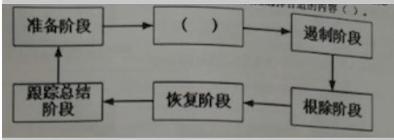
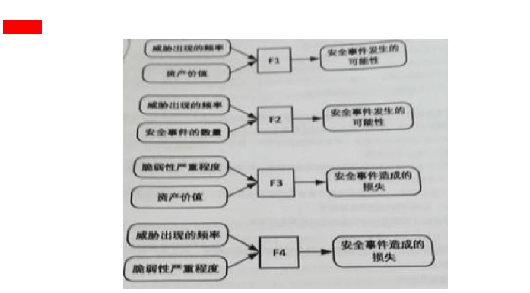
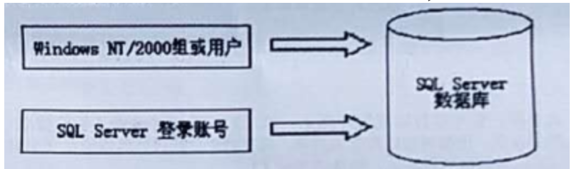

## 试题

1. 某贸易公司的OA系统由于存在系统漏洞，被攻击者传上了木马病毒并删除了系统中的数据，由于系统备份是每周六进行一次，事件发生时间为周三，因此导致该公司三个工作日的数据丢失并使得OA系统在随后两天内无法访问，影响到了与公司有业务往来部分公司业务。在事故处理报告中，根据GB/z20986-2007《信息安全事件分级分类指南》，该事件的准确分类和定级应该是（）

	A.有害程序事件特别重大事件（I级）

	B.信息破坏事件重大事件（II级）

	C.有害程序事件较大事件（III级）

	**D.信息破坏事件一般事件（IV级）**

2. 小华在某电子商务公司工作，某天他在查看信息系统设计文档时，发现其中标注该信息系统的RPO（恢复点目标）指标为3小时。请问这意味着（）

	A.该信息系统发生重大安全事件后，工作人员应在3小时内到位，完成问题定位和应急处理工作

	B.该信息系统发生重大安全事件后，工作人员应在3小时内完整应急处理工作并恢复对外运行

	C.该信息系统发生重大安全事件后，工作人员在完成处置和灾难恢复工作后，系统至少能提供3小时的紧急业务服务能力

	**D.该信息系统发生重大安全事件后，工作人员在完成处置和灾难恢复工作后，系统至多能丢失3小时的业务数据**

3. 京某公司利用SSE-CMM对其自身工程队伍能力进行自我改善，其理解正确的是（）

	**A.系统安全工程能力成熟度模型（SSE-CMM）定义了6个能力级别。当工程队伍不能执行一个过程域中的基本实践时，该过程域的过程能力是0级**

	B.达到SSE-CMM最高级以后，工程队伍执行同一个过程，每次执行的结果质量必须相同

	C.系统安全工程能力成熟度模型（SSE-CMM）定义了3个风险过程：评价威胁，评价脆弱性，评价影响

	D.SSE-CMM强调系统安全工程与其他工程学科的区别性和独立性。

4. 操作系统用于管理计算机资源，控制整个系统运行，是计算机软件的基础，操作系统安全是计算、网络及信息系统安全的基础，一般操作系统都提供了相应的安全配置接口，小王新买了一台计算机，开机后首先对带的Windows操作系统进行配置，他的主要操作有：（1）关闭不必要的服务和端口；（2）在"本地安全策略"中配置账号策略、本地策略、公钥策略和IP安全策略：（3）备份敏感文件，禁止建立空连接，下栽最新补丁：（4）关闭审核策略，开启口令策略，开启口令策略，开启账户策略，这些操作中错误的是（）

	A.操作（1），应该关闭不必要的服务和所有端口

	B.操作（2），在"本地安全策略"中不应该配置公钥策略，而应该配置私钥策略

	C.操作（3），备份敏感文件会导致这些文件遭到窃取的几率增加

	**D.操作（4），应该开启审核策略**

5. 若一个组织声称自己的ISMS符合ISO/IEC27001或GB/T22020标准要求，其信息安全控制措施通常需要在资产管理方面实施常规控制，资产管理包含对资产负责和信息分类两个控制目标。信息分类控制的目标是为了确保信息受到适当级别的保护，通常采取以下哪项控制措施（）

	A.资产清单

	B.资产责任人

	C.资产的可接受使用

	**D.分类指南、信息的标记和处理**

6. PDCA循环又叫戴明环，是管理学常用的一种模型，关于PDCA四个字母，下面理解错误的是（）

	A.P是Plan指分析问题，发现问题，确定方针、目标和活动计划

	B.D是Do指实施、具体运作，实现计划中的内容

	C.C是check指检查总结执行计划的结果，明确效果，找出问题

	**D.A指Aim指瞄准问题，抓住安全事件的核心，确定责任**

7. 关于信息安全管理体系的作用，下面理解错误的是

	A.对内而言，有助于建立起文档化的信息安全管理规范，实现有"法"可依，有据可查

	**B.对内而言，是一个光花钱不挣钱的事情，需要组织通过其他方法收入来弥补投入**

	C.对外而言，有助于使各科室相关方对组织充满信心

	D.对外而言，规范工作流程要求，帮助界定双方各自信息安全责任

8. 某集团公司根据业务需求，在各地分支机构部属前置机，为了保证安全，集团总部要求前置机开放日志共享，由总部服务器采集进行集中分析，在运行过程中发现攻击者也可通过共享从前置机种提取日志，从而导致部分敏感信息泄露，根据降低攻击面的原则，应采取以下哪项处理措施？

	A.由于共享导致了安全问题，应直接关闭日志共享，禁止总部提取日志进行分析

	B.为配合总部的安全策略，会带来一定安全问题，但不影响系统使用，因此接受此风险

	C.日志的存在就是安全风险，最好的办法就是取消日志，通过设置前置机不记录日志

	**D.只允许特定IP地址从前置机提取日志，对日志共享设置访问密码且限定访问的时间**

9. 不同的信息安全风险评估方法可能得到不同的风险评估结果，所以组织机构应当根据各自的实际情况选择适当的风险评估方法。下面的描述中错误的是（）

	A.定量风险分析试图从财务数字上对安全风险进行评估，得出可以量化的风险分析结果，以度量风险的可能性和缺失量

	**B.定量风险分析相比定性风险分析能得到准确的数值，所以在实际工作中应使用定量风险分析，而不应选择定性风险分析**

	C.定性风险分析过程中，往往需要凭借分析者的经验和直接进行，所以分析结果和风险评估团队的素质、经验和知识技能密切相关

	D.定性风险分析更具主观性，而定量风险分析更具客观性

10. 随机进程名称是恶意代码迷惑管理员和系统安全检查人员的技术手段之一，以下对于随机进程名技术，描述正确的是（）

	A.随机进程名技术虽然每次进程都是随机的，但是只要找到了进程名称，就找到了恶意代码程序本身

	B.恶意代码生成随机进程名称的目的是使进程名称不固定，因为杀毒软件是按照进程名称进行病毒进程查杀

	C.恶意代码使用随机进程名是通过生成特定格式的进程名称，使进程管理器中看不到恶意代码的进程

	**D.随机进程名技术每次启动时随机生成恶意代码进程名称，通过不固定的进程名称使自己不容易被发现真实的恶意代码程序名称**

11. 软件存在漏洞和缺陷是不可避免的，实践中常用软件缺陷密度（Defects/KLOC）来衡量软件的安全性，假设某个软件共有29.6万行源代码，总共被检测出145个缺陷啊，则可以计算出其软件缺陷密度值是（）

	A.0.00049

	B.0.049

	**C.0.49**

	D.49

	> 缺陷密度=缺陷数量/代码行或功能点的数量
	>
	> > 缺陷数量=1000*缺陷总数
	>
	> 一个29.6万行的源程序总共有145个缺陷
	>
	> 则：缺陷密度=1000*145/296000=0.49

12. Windows系统中，安全标识符（SID）是标识用户、组和计算机账户的唯一编码，在操作系统内部使用，当授予用户、组、服务或者其他安全主休访问对象的权限时，操作系统会把SID和权限写入对象的ACL中，小刘在学习了SID的组成后，为了巩固所学知识，在自己计算机的Windows操作系统中使用whooml/users操作查看当前用户的SID，得到是的SID为S-1-5-21-1534169462-1651380828-111620652-500。下列选项中，关于此SID的理解错误的是（）

	A.前三位S-1-5表示此SID是由WindowsNT颁发的

	B.第一个子颁发机构是21

	C.WindowsNT的SID的三个子颁发机构是1534169462、1651380828、111620651

	**D.此SID以500结尾，表示内置guest**

13. 保护-检测-响应（Protection-Detection-Hesponse，PDR）模型是（）工作中常用的模型，其思想是承认（）中漏洞的存在，正视系统面临的（）。通过采取适度防护、加强（）、落实对安全事件的响应、建立对威胁的防护来保障系统的安全

	A.信息系统；信息安全保障；威胁；检测工作

	B.信息安全保障；信息系统；检测工作；威胁

	**C.信息安全保障；信息系统；威胁；检测工作**

	D.信息安全保障；威胁；信息系统；检测工作

14. 老王是某政府信息中心主任，以下哪项项目是符合《保守国家秘密法》要求的（）

	A.老王安排下属小李将损害的涉密计算机的某国外品牌硬盘送到该品牌中国区维修中心修理

	B.老王要求下属小张把中心所有计算机贴上密级标志

	C.老王每天晚上12点将涉密计算机连接上互联网更新杀毒软件病毒库

	**D.老王提出对加密机和红黑电源插座应该与涉密信息系统同步投入使用**

15. 信息安全保障技术框架（InformationAssuranceTechnicalFramework，IATF），目的是为保障政府和工业的（）提供了（）。信息安全保障技术框架的核心思想是（）。深度防御战略的三个核心要素：（）、技术和运行（亦称为操作）。

	**A.信息基础设施；技术指南；深度防御；人员**

	B.技术指南；信息基础设施；深度防御；人员

	C.信息基础设施；深度防御；技术指南；人员

	D.信息基础设施；技术指南；人员；深度防御

16. ApacheHttpServer（简称Apache）是一个开放源码的Web服务运行平台，在使用过程中，该软件默认会将自己的软件名和版本号发送给客户端。从安全角度出发，为隐藏这些信息，应当采取以下哪种措施（）

	A.安装后，修改访问控制配置文件

	**B.安装后，修改配置文件Http.Conf中的有关参数**

	C.安装后，删除ApacheHttpServer源码

	D.从正确的官方网站下载ApacheHttpServer，并安装使用

17. 有关系统安全工程-能力成熟度模型（SSE-CMM），错误的理解是（）

	A.SSE-CMM要求实施组织与其他组织相互作用，如开发方、产品供应商、集成商和咨询服务商等

	B.SSE-CMM可以使安全工程成为一个确定的、成熟的和可度量的科目

	**C.基于SSE-CMM的工程是独立工程，与软件工程，硬件工程，通信工程等分别规划实施**

	D.SSE-CMM覆盖整个组织的活动，包括管理、组织和工程活动等，而不仅仅是系统安全的工程活动

18. 小王在学习定量风险评估方法后，决定试着为单位机房计算火灾的风险大小，假设单位机房的总价值为400万元人民币，暴露系数（ExposureFactor，EF）是25%，年度发生率（AnnualixedRateofOccurrence，ARO）为0.2。那么小王计算的年度预算损失（AnnualixedLossExpectancy，ALE）应该是（）

	A.100万元人民币

	B.400万元人民币

	**C.20万元人民币**

	D.180万元人民币

19. ISO9001-2000标准在制定、实施质量管理体系以及改进其有效性时采用过程方法，通过满足顾客要求增进顾客满意。下图是关于过程方法的示意图，图中括号空白处应填写（）

	

	A.策略

	B.管理者

	C.组织

	**D.活动**

20. 信息安全组织的管理涉及内部组织和外都各方两个控制目标。为了实现对组织内部信息安全的有效管理，应读实施常规的控制措施。不包括哪热选项（）

	A.信息安全的管理承诺、信息安全协调、信息安全职责的分配

	B.信息处理设施的授权过程、保密性协议、与政府部门的联系

	C.与特定利益集团的联系、信息安全的独立评审

	**D.与外部各方相关风险的识别、处理外部各方协议中的安全问题**

21. 在信息安全风险管理过程中，背景建立是实施工作的第一步，下面哪项是错误的（）

	A.背景建立的依据是国家，地区行业的相关政策、法律、法规和标准，以及机构的使命，信息系统的业务目标和特性

	**B.背景建立阶段应识别需要保护的资产、面临的威胁以及存在的脆弱性，并分别赋值，同时确认已有的安全措施，形成需要保护的资产清单**

	C.前景建立阶段应调查信息系统的业务目标、业务特性、管理特性和技术特性、形成信息系统的描述报告

	D.背景建立阶段应分析信息系统的体系结构和关键要素，分析信息系统的安全环境和要求，形成信息系统的安全要求报告

22. 某单位在一次信息安全风险管理活动中，风险评估报告提出服务器A的FTP服务存在高风险漏洞。随后该单位在风险处理时选择了关闭FTP服务的处理措施。请问该措施属于哪种风险处理方式（）

	A.风险降低

	**B.风险规避**

	C.风险转移

	D.风险接受

23. 应急响应是信息安全事件管理的重要内容之一，关于应急响应工作，下面描述错误的是（）

	A.信息安全应急响应，通常是指一个组织为了应对各种安全意外事件的发生所采取的防范措施。即包括预防性措施，也包括事件发生后的应对措施

	B.应急响应工作有其鲜明的特点：具有高技术复杂性与专业性、强突发性、对知识经验的高依赖性，以及需要广泛的协调与合作

	**C.应急响应是组织在处置应对突发/重大信息安全事件时的工作，其主要包括两部分工作：安全事件发生时的正确指挥、事件发生后全面总结**

	D.应急响应工作的起源和相关机构的成立和1988年11月发生的莫里斯蠕虫病毒事件有关，基于该事件，人们更加重视安全事件的应急处置和整体协调的重要性

24. 若一个组织声称自己的ISMS符合ISO/TEC27001或GB22080标准要求，其信息安全控制措施通常在以下方面实施常规控制，不包括哪一项（）

	A.信息安全方针、信息安全组织、资产管理

	B.人力资源安全、物理和环境安全、通信和操作管理

	C.访问控制、信息系统获取、开发和维护、符合性

	**D.规划与建立ISMS**

25. 在国家标准GB/T202741-2006《信息安全技术信息系统安全保障评估框架第一部分：简介和一般模型》中，信息系统安全保障模型包含哪几个方面（）

	A.保障要素、生命周期和运行维护

	**B.保障要素、生命周期和安全特征**

	C.规划组织、生命周期和安全特征

	D.规划组织、生命周期和运行维护

26. 有关危害国家秘密安全的行为包括（）

	**A.严重违反保密规定行为，定密不当行为，公共信息网络运营商及服务商不履行保密义务的行为、保密行政管理部门的工作人员的违法行为**

	B.严重违反保密规定行为，公共信息网络运营商及服务商不履行保密义务的行为、保密行政管理部门的工作人员的违法行为，但不包括定密不当行为

	C.严重违反保密规定行为，定密不当行为、保密行政管理部门的工作人员的违法行为，但不包括公共信息网络运营商及服务商不履行保密义务的行为

	D.严重违反保密规定行为，定密不当行为，公共信息网络运营商及服务商不履行保密义务的行为，但不包括保密行政管理部门的工作人员的违法行为

27. 私有IP地址是一段保留的IP地址。只适用在局域网中，无法在Internet上使用。关于私有地址，下面描述正确的是（）

	A.A类和B类地址中没有私有地址，C类地址中可以设置私有地址

	B.A类地址中没有私有地址，B类和C类地址中可以设置私有地址

	**C.A类、B类和C类地址中都可以设置私有地址**

	D.A类、B类和C类地址中都没有私有地址

28. 《国家信息化领导小组关于加强信息安全保障工作的意见》中办发2003/27号明确了我国信息安全保障工作（）、加强信息安全保障工作的（）、需要重点加强的信息安全保障工作。27号文的重大意义是，它标志着我国信息安全保障工作有了（）、我国最近十余年的信息安全保障工作都是围绕着6件来（）的、促进了我国（）的各项工作。

	A.方针；主要原则；总体纲领；展开和推进；信息安全保障建设

	B.总体要求；总体纲领；主要原则；展开；信息安全保障建设

	**C.方针和总体要求；主要原则；总体纲领；展开和推进；信息安全保障建设**

	D.总体要求；主要原则；总体纲领；展开；信息安全保障建设

29. 信息系统建设完成后，到达（）的信息系统的而运营使用单位应当选择符合国家规定的测评机构进行测评合格后方可投入使用

	**A.二级以上**

	B.三级以上

	C.四级以上

	D.五级以上

30. 由于Internet的安全问题日益突出，基于TCP/IP协议，相关组织和专家在协议的不同层次设计了相应的安全通信协议，用来保障网络各层次的安全。其中，属于或依附于传输层的安全协议是（）

	A.PP2P

	B.L2TP

	**C.SSL**

	D.IPSec

31. 以下系统工程说法错误的是

	**A.系统工程是基本理论的技术实现**

	B.系统工程是一种对所有系统都具有普遍意义的科学方法

	C.系统工程是组织管理系统规划、研究、制造、试验、使用的科学方法

	D.系统工程是一种方法论

32. 按照我国信息安全等级保护的有关政策和标准，安全保护等级确定为（）以上的等级保护对象，其网络运营者需要组织进行专家评审、主管部门审核和备案审核，并保送至公安机关进行定级备案

	A.零级系统

	B.一级系统

	**C.二级系统**

	D.三级系统

33. 为了能够合理、有序地处理安全事件，应事件制定出事件应急响应方法和过程，有助于一个组织在事件发生时阻止混乱的发生或是在混乱状态中迅速恢复控制，将损失和负面影响降至最低。PDCERF方法论是一种防范使用的方法，其将应急响应分成六个阶段，如下图所示，请为图中括号空白处选择合适的内容（）

	

	A.培训阶段

	B.文档阶段

	C.报告阶段

	**D.检测阶段**

34. 信息安全管理体系（ISMS）的建设和实施是一个组织的战略性举措。若一个组织声称自己的ISMS符合ISO/IBC27001或G8/T22080标准要求，则需实施准要求，则需实施以下ISMS建设的各项工作。哪一项不属于ISMS建设的工作（）

	A.规划与建立ISMS

	B.实施和运行ISMS

	C.监视和评审ISMS

	**D.保持和审核ISMS**

35. 在某次信息安全应急响应过程中，小王正在实施如下措施：消除或阻断攻击源，找到并消除系统的脆弱性/漏洞、修改安全策略，加强防范措施、格式化被感染而已程序的介质等，请问，按照应急响应方法，这些工作应处于以下哪个阶段（）

	A.准备阶段

	B.检测阶段

	C.遏制阶段

	**D.根除阶段**

36. 关于《网络安全法》域外适用效力的理解，以下哪项是错误的（）

	**A.当前对于境外的网络攻击，我国只能通过向来源国采取抗议**

	B.对于来自境外的网络安全威胁我国可以组织技术力量进行监测，防御和处置

	C.对于来自境外的违法信息我国可以加以阻断传播

	D.对于来自境外的网络攻击我国可以追究其法律责任

37. 规范的实施流程和文档管理，是信息安全风险评估能否取得成功的重要基础。某单41位在实施风险评估时，形成了《待评估信息系统相关设备及资产清单》。在风险评估实施的各个阶段中，该《待评估信息系统相关设备及资产清单》应是如下（）

	A.风险评估准备

	**B.风险要素识别**

	C.风险分析

	D.风险结果判定

38. 有关危害国家秘密安全的行为的法律责任，正确的是：

	**A.严重违反保密规定行为只要发生，无论产生泄密实际后果，都要依法追究责任**

	B.非法获取国家秘密，不会构成刑事犯罪，不需承担刑事责任

	C.过失泄露国家秘密，不会构成刑事犯罪，不需承担刑事责任

	D.承担了刑事责任，无需再承担行政责任和/或其他处分

39. 作为信息安全从业人员，以下哪种行为违反了CISP职业道德准则

	A.抵制通过网络系统侵犯公众合法权益

	**B.通过公众网络传播非法软件**

	C.不在计算机网络系统中进行造谣，欺诈，诽谤等活动

	D.帮助和指导信息安全同行提升信息安全保障知识和能力

40. 某购物网站开发项目经过需求分析进入系统设计阶段，为了保证用户账户的安全，项目开发人员决定用户登录时除了用户名口令认证方式外，还加入基于数字证书的身份认证功能，同时用户口令使用SHA-1算法加密后存放在后台数据库中，请问以上安全设计遵循的是哪项安全设计原则：

	A.最小特权原则

	B.职责分离原则

	**C.纵深防御原则**

	D.最少共享机制原则

41. 防火墙是网络信息系统建设中常常采用的一类产品，它在内外网隔离方面的作用是

	A.既能物理隔离，又能逻辑隔离

	B.能物理隔离，但不能逻辑隔离

	**C.不能物理隔离，但是能逻辑隔离**

	D.不能物理隔离，也不能逻辑隔离

42. 关于计算机取证描述不正确的是（）

	A.计算机取证是使用先进的技术和工具，按照标准规程全面地检查计算机系统，以提取和保护有关计算机犯罪的相关证据的活动

	B.取证的目的包括：通过证据查找肇事者，通过证据推断受害都损失程度及收集证据提供法律支持

	**C.电子证据是计算机系统运行过程中产生的各种信息记录存储的电子化资料及物品，对于电子证据，取证工作主要围绕两方面进行，证据的获取和证据的保护**

	D.计算机取证的过程可以分为准备、保护、提取、分析和提交5个步骤

43. 为推动和规范我国信息安全等级保护，我国制定和发布了信息安全等级保护工作所需要的一系列标准，这些标准可以按照等级保护工作的工作阶段大致分类。下面四个标准中，（）提出和规定了不同安全保护等级信息系统的最低保护要求，并按照技术和管理两个方面提出了相关基本安全要求

	**A.GB/T222392008《信息系统等级保护安全设计技术要求》**

	B.GB/T22240-2008（信息系统安全保护等级定级指南》

	C.GB/T250702010《信息系统等级保护安全设计技术要求》

	D.GB/T284492012（信息系统安全等级保护测评过程指南》

44. 自主访问控制模型（DAC）的访问控制关系可以用访问控制表（ACL）来表示，该ACL利用在客体上附加一个主体明细表的方法来表示访问控制矩阵，通常使用由客体指向的链表来存储相关数据。下面选项中说法正确的是（）。

	A.ACL是Bell-LaPadula模型的一种具体实现

	B.ACL在删除用户时，去除该用户所有的访问权限比较方便

	C.ACL对于统计某个主体能访问哪些客体比较方便

	**D.ACL在增加客体时，增加相关的访问控制权限较为简单**

45. 你是单位安全主管，由于微软刚发布了数个系统漏洞补丁，安全运维人员给出了针对此漏洞修补的四个建议方案，请选择其中一个最优先方案执行（）

	A.由于本次发布的漏洞目前尚未出现利用工具，因此不会对系统产生实质性危害

	B.本次发布的漏洞目前尚未出现利用工具，因此不会对系统产生实质性危害，所以可以先不做处理

	**C.对于重要的服务，应在测试环境中安装并确认补丁兼容性问题后再正式生产环境中部署**

	D.对于服务器等重要设备，立即使用系统更新功能安装这批补丁，用户终端计算机由于没有重要数据，由终端自行升级

46. 小赵是某大学计算机科学与技术专业的毕业生，在前往一家大型企业应聘时，面试经理要求他给出该企业信息系统访问控制模型的设计思路。如果想要为一个存在大量用户的信息系统实现自主访问控制功能，在以下选项中，从时间和资源消耗的角度，下列选项中他应该采取的最合适的模型或方法是（）

	**A.访问控制列表（ACL）**

	B.能力表（CL）

	C.BLP模型

	D.Biba模型

47. 以下关于项目的含义，理解错误的是：

	A.项目是为达到特定的目的、使用一定资源、在确定的期间内、为特定发起人而提供独特的产品、服务或成果而进行的一次性努力。

	**B.项目有明确的开始日期，结束日期由项目的领导者根据项目进度来随机确定。**

	C.项目资源指完成项目所需要的人、财、物等。

	D.项目目标要遵守SMART原则，即项目的目标要求具体（Specific）、可测量（Measurable）、需相关方的一致同意（Agreeto）、现实（Realistic）、有一定的时限（Timeoriented）

48. 关于标准，下面哪项理解是错误的（）

	A.标准是在一定范围内为了获得最佳秩序，经协协商一致制定并由公认机构批准，共同重复使用的一种规范性文件，标准是标准化活动的重要成果

	**B.国际标准是由国际标准化组织通过并公布的标准，同样是强制性标准，当国家标准和国际标准的条款发生冲突，应以国际标准条款为准。**

	C.行业标准是针对没有国家标准而又才需要在全国某个行业范围统一的技术要求而制定的标准，同样是强制性标准，当行业标准和国家标准的条款发生冲突时，应以国家标准条款为准。

	D.地方标准由省、自治区、直辖市标准化行政主管部门制度，冰报国务院标准化行政主管部门和国务院有关行政主管培训部门备案，在公布国家标准后，该地方标准即应废止。

49. 分布式拒绝服务（DDoS）攻击指借助于客户/服务器技术，将多个计算机联合起来作为攻击平台，对一个或多个目标发动DDoS攻击，从而成倍地提高拒绝服务攻击的威力，一般来说，DDoS攻击的主要目的是破坏目标系统的（）：

	A.保密性

	B.完整性

	**C.可用性**

	D.真实性

50. 王工是某单位的系统管理员，他在某次参加了单位组织的风险管理工作时，根据任务安排，他使用了Nessus工具来扫描和发现数据库服务器的漏洞，根据风险管理的相关理论，他这个是扫描活动属于下面哪一个阶段的工作（）

	A.风险分析

	**B.风险要素识别**

	C.风险结果判定

	D.风险处理

51. GB/T22080-2008《信息技术安全技术信息安全管理体系要求》指出，建立信息安全管理体系应参照PDCA模型进行，即信息安全管理体系应包括建立ISMS、实施和运行ISMS、监视和评审ISMS、保持和改进ISMS等过程，并在这些过程中应实施若干活动，请选出以下描述错误的选项（）

	A."制定ISMS方针"是建产ISMS阶段工作内容

	B."实施培训和意识教育计划"是实施和运行ISMS阶段工作内容

	C."进行有效性测量"是监视和评审ISMS阶段工作内容

	**D."实施内部审核"是保护和改进ISMS阶段工作内容**

52. 关于信息安全应急响应管理过程描述不正确的是（）

	A.基于应急响应工作的特点和事件的不规则性，事先制定出事件应急响应方法和过程，有助于一个组织在事件发生时阻止混乱的发生成是在混乱状态中迅速恢复控制，将损失和负面影响降全最低

	B.应急响应方法和过程并不是唯一的

	C.一种被广为接受的应急响应方法是将应急响应管理过程分为准备、检测、遏制、根除，恢复和跟踪总结6个阶段

	**D.一种被广为接受的应急响应方法是将应急响应管理过程分为准备、检测、遏制、根除、恢复和跟踪总结6个阶段。这6个阶段的响应方法一定能够确保事件处理的成功。**

53. 下面关于信息系统安全保障模型的说法不正确的是：

	A.国家标准《信息系统安全保障评估框架第一部分：简介和一般模型》（GB/T20274.1-2006）中的信息系统安全保障模型将风险和策略作为基础和核心

	B.模型中的信息系统生命周期模型是抽象的概念性说明模型，在信息系统安全保障具体操作时，可根据具体环境和要求进行改动和细化

	C.信息系统安全保障强调的是动态持续性的长效安全，而不仅是某时间点下的安全

	**D.信息系统安全保障主要是确保信息系统的保密性、完整性和可用性，单位对信息系统运行维护和使用的人员在能力和培训方面不需要投入**

54. 有关能力成熟度模型（CMM），错误的理解是（）

	**A.CMM的基本思想是，因为问题是由技术落后引起的，所以新技术的运用会在一定程度上提高质量、生产率和利润率**

	B.CMM是思想来源于项目管理和质量管理

	C.CMM是一种衡量工程实施能力的方法，是一种面向工程过程的方法

	D.CMM是建立在统计过程控制理论基础上的，它基于这样一个假设，即"生产过程的高质量和在过程中组织实施的成熟性可以低成本的生产出高质量产品

55. 某信息安全公司的团队对某款名为"红包快抢"的外挂进行分析发现此外挂是一个典型的木马后门，使黑客能够获得受害者电脑的访问权，该后门程序为了达到长期驻留在受害者的计算机中，通过修改注册表启动项来达到后门程序随受害者计算机系统启动而启动为防范此类木马的攻击，以下做法无用的是（）。

	A.不下载、不执行、不接收来历不明的软件和文件

	B.不随意打开来历不明的邮件，不浏览不健康不正规的网站

	**C.使用用户名和密码信息**

	D.安装反病毒软件和防火墙，安装专门的木马防范软件

56. 王工是某单位的系统管理员，他在某次参加了单位组织的风险管理工作时，根据任务安排，他依据已有的资产列表，逐个分析可能危害这些资产的主体、动机、途径等多种因素，分析这些因素出现机造成损失的可能性大小，并为其赋值。请问，他这个工作属于下面哪一个阶段的工作（）

	A.资产识别并赋值

	B.脆弱性识别并赋值

	**C.威胁识别并赋值**

	D.确认已有的安全措施并赋值

57. 在信息安全管理体系的实施过程中，管理者们作用对于信息安全管理体系能否成功实施非常重要，但是以下选项中不属于管理者应有职责的是（）。

	A.制定并颁布信息安全力针。为组织的信息安全管理体系建设指明力向并提供具体纲领，明确总体要求。

	B.确保组织的信息安全管理体系目标和相应的计划得以制定，目标应明确，可度量，计划应具体，可实施

	C.向组织传达满足信息安全的重要性，传达满足信息安全要求，达成信息安全目标，符合信息安全方针，履行法律责任和持续改进的重要性

	**D.建立健全信息安全制度，明确安全风险管理作用，实施信息安全风险评估过程，确保信息安全风险评估技术选择合理、计算正确。**

58. 有关系统安全工程-能力成熟度模型（SSE-CMM）中的通用实施（GenericPractices，GP），理解的理解是（）

	A.GP是涉及过程的管理、测量和制度化方面的活动

	**B.GP适用于域维中部分过程区域（ProcessAreas，PA）的活动而非所有PA的活动（课本170页内容，GP是通用实施，适用于所有过程区域）。**

	C.在工程实施时，GP应该作为基本实施（Base，Practices，BP）的一部分加以执行

	D.在评估时，GP用于判定工程组织执行某个PA的能力

59. 为保障信息系统安全，某经营公众服务系统的公司准备并编制一份针对性的信息安全保障方案，并严格编制任务交给了小王，为此，小王决定首先编制出一份信息安全需求描述报告，关于此项工作，下面说法错误的是（）

	**A.信息安全需求报告应依据该公众服务信息系统的功能设计方案为主要内容来撰写**

	B.信息安全需求描述报告是设计和撰写信息安全保障方案的前提和依据

	C.信息安全需求描述报告应当基于信息安全风险评估结果和有关政策法规和标准的合规性要求得到

	D.信息安全需求描述报告的主体内容可以按照技术、管理和工程等方面需求械开编写

60. 若一个组织声称自己的ISMS符合ISO/1E27001减GR/72060标难要求，其信息安全控制措施通常需要在符合性方面实施常规控制。符合性常规控制这一领域不包括以下哪项控制目标（）

	A.符合法律要求

	B.符合安全策略和标准以及技术符合性

	C.信息系统审核考虑

	**D.访问控制的业务要求、用户访问管理**

61. 恢复时间目标（RecoveryTimeObjective，RTO）和恢复点目标（RECOVERYPointObjective，RPO）是业务连续性和灾难恢复工作中的两个重要指标，随着信息系统越来越重要和信息技术越来越先进，这两个指标的数值越来越小。小华准备为其工作的信息系统拟定RTO和RPO指标，则以下描述中，正确的是（）

	**A.RTO可以为0，RPO也可以为0**

	B.RTO可以为0，RPO不可以为0

	C.RTO不可以为0，RPO可以为0

	D.RTO不可以为0，RPO也不可以为0

62. 某网络安全公司基于网络的实时入侵检测技术，动态监测来自于外部网络和内部网络的所有访问行为。当检测到来自内外网络针对或通过防火墙的攻击行为，会及时响应，并通知防火墙实时阻断攻击源，从而进一步提高了系统的抗攻击能力，更有效地保护了网络资源，提高了防御体系级别。但入侵检测技术不能实现以下哪种功能（）。

	A.检测并分析用户和系统的活动

	B.核查系统的配置漏洞，评估系统关键资源和数据文件的完整性

	**C.防止IP地址欺骗**

	D.识别违反安全策略的用户活动

63. 对信息安全事件的分级参考下列三个要素：信息系统的重要程度、系统损失和社会影响，依据信息系统的重要程度对信息进行划分，不属于正确划分级别的是：

	A.特别重要信息系统

	B.重要信息系统

	C.一般信息系统

	**D.关键信息系统**

64. 以下关于威胁建模流程程步骤说法不正确的是（）

	A.威胁建模主要流程包过四步；确定建模对象、识别威胁、评估威胁和消减威胁

	B.评估威胁是对威胁进行分析，评估被利用和攻击发生的概率，了解被攻击资产的受损后果，并计算风险

	C.消减威胁是根据威胁的评估结果，确定是否要消除该威胁以及消减的技术措施，可以通过重新设计直接消除威胁，或设计采用技术手法来消减威胁

	**D.识别威胁是发现组件或进程存在的威胁，它可能是悉意的，威胁就是漏洞**

65. CC标准是目前系统安全认证方面最权威的标准，以下哪一项没有体现CC标准的先进性（）

	A.结构的开放性，即功能和保证要求都可以在具体的"保护轮廓"和"安全目标"中进一步细化和扩展

	B.表达方式的通用性，即给出通用的表达方式

	**C.独立性，它强调将安全的功能和保证分离**

	D.实用性，将CC的安全性要求具体应用到IT产品的开发、生产、测试和评估过程中

66. 一个信息管理系统通常会对用户进行分组并实施访问控制。例如，在一个学校的教务系统中，教师能够录入学生的考试成绩，学生只能查看自己的分数，而学校教务部门的管理人员能够对课程信息、学生的选课信息等内容进行修改。下列选项中，对访问控制的作用的理解错误的是：

	**A.对经过身份鉴别后的合法用户提供所有服务**

	B.拒绝非法用户的非授权访问请求

	C.在用户对系统资源提供最大限度共享的基础上，对用户的访问权进行管理

	D.防止对信息的非授权篡改和滥用

67. GaryMoGrow博士及其合作都提出软件安全应由三根支柱来支撑，这三个支柱是（）

	A.测代码审核，风险分析和渗透测试

	**B.应用风险管理，软件安全接触点和安全知识**

	C.威胁建模，渗透测试和软件安全接触点

	D.威胁建模，测代码审核和模模糊测试

68. 部署互联网协议安全虚拟专用网（InternetprotocolSecurityVirtualPrivateNetwork，IPsecVPN）时，以下说法正确的是：

	A.配置MD5安全算法可以提供可靠的数据加密

	B.配置AES算法可以提供可靠的数据完整性验证

	**C.部署IPsecVPN网络时，需要考虑IP地址的规划，尽量在分支节点使用可以聚合的IP地址段，来减少IPsec安全关联（SecurityAuthentication，SA）资源的消耗**

	D.报文验证头协议（AuthenticationHeader，AH）可以提供数据机密

69. Linux系统的安全设置主要从磁盘分区、账户安全设置、禁用危险服务、远程登录安全、用户鉴别安全、审计策略、保护root账户、使用网络防火墙和文件权限操作共10个方面来完成，小张在学习了Linux系统安全的相关知识后，尝试为自己计算机的Linux系统进行安全配置。下列选项是他的部分操作，其中不合理是（）

	**A.编辑文件/etc/passwd，检查文件中用户ID，禁用所有的ID=0的用户**

	B.编辑文件/etc/ssh/sshd_config，将Penmitroorlogin设置为no

	C.编辑文件/etc/pam.d/system-auth，设置authrequiredpam_tally.soonerr=faildeny=6unlock_time=300

	D.编辑文件/etc/profile，设置TMOUT=600

70. 以下关于互联网协议安全（InternetProtocolSecurity，IPsec）协议说法错误的是（）

	A.在传送模式中，保护的IP负载

	B.验证头协议（AuthenticationHead，AH）和IP封装安全载荷协议（Encapsu；atingSecurityPayload，ESP）都能以传输模式式作

	C.在隧道模式中，保护的是整个互联网协议（InternetProtocol，IP）包，包括IP头

	**D.IPsec仅能保证传输数据的可认认证性和保密性**

71. 在信息系统中，访问控制是重要的安全功能之一。他的任务是在用户对系统资源提供最大限度共享的基础上，对用户的访问权限进行管理，防止对信息的非授权篡改和滥用。访问控制模型将实体划分为主体和客体两类，通过对主体身份的识别来限制其对客体的访问权限。下列选项中，对主体、客体和访问权限的描述中错误的是（）

	A.对文件进行操作的用户是一种主体

	B.主体可以接受客体的信息和数据，也可能改变客体相关的信息

	C.访问权限是指主体对客体所允许的操作

	**D.对目录的访问权可分为读、写和拒绝访问**

72. Kerberos协议是常用的集中访问控制协议，通过可信第三方的认证服务，减轻应用服务器和负担。Kerberos的运行环境由密钥分发中心（）、应用服务器和客户端三个部分组成。其中，KDC分为认证服务器AS和票据授权服务器TGS两部分。下图展示了Kerberos协议的三个阶段，分别为（1）Kerberos获得服务许可票据，（2）Kerberos获得服务，（3）Kerberos获得票据许可票据。下列选项中对这三个阶段的排序正确的是（）

	

	A.（1）→（2）→（3）

	B.（3）→（2）→（1）

	C.（2）→（1）→（3）

	**D.（3）→（1）→（2）**

73. 王工是某单位的系统管理员，他在某次参加了单位组织的风险管理工作时，发现当前案例中共有两个重要资产：资产A1和资产A2：其中资产A1面临两个主要威胁：威胁T1和威胁T2；而资产A2面临一个主要威胁：威胁T3；威胁T1可以利用的资产A1存在的两个脆弱性：脆弱性V1和脆弱性V2；威胁T2可以利用的资产A1存在的三个脆弱性，脆弱性V3、脆弱性V4和脆弱性V5；威胁T3可以利用的资产A2存在的两个脆弱性：脆弱性V6和脆弱性V7根据上述条件，请问：使用相乘法时，应该为资产A1计算几个风险值（）

	A.2

	B.3

	C.5

	D.6

	> 威胁识别：T
	>
	> 脆弱性识别：V
	>
	> > 脆弱性的严重程度：VA
	>
	> 资产识别：A
	>
	> > 资产价值：LA
	>
	> 安全事件的可能性：$L=\sqrt{TV}$
	>
	> 安全事件造成的损失：$F=\sqrt{AV}$
	>
	> 风险值：$R=\sqrt{LF}$

74. 规范的实施流程和文档管理，是信息安全风险评估能否取得成果的重要基础，某单位在实施风险评估时，按照规范形成了若干文档，其中，下面（）中的文档应属于风险评估中"风险要素识别"阶段输出的文档。

	A.《风险评估方案》，主要包括本次风险评估的目的、范围、目标、评估步骤、经费预算和进度安排等内容

	B.《风险评估方法和工具列表》，主要包括拟用的风险评估方法和测试评估工具等内容

	C.《风险评估准则要求》，主要包括现有风险评估参考标准、采用的风险分析方法、资产分类标准等内容

	**D.《已有安全措施列表》，主要包括经检查确认后的已有技术和管理各方面安全措施等内容**

75. 小李在某单位是负责信息安全风险管理方面工作的部门领导，主要负责对所在行业的新人进行基本业务素质培训，一次培训的时候，小李主要负责讲解风险评估方法。请问小李的所述论点中错误的是哪项：

	A.风险评估方法包括：定性风险分析、定量风险分析以及半定量风险分析

	**B.定性风险分析需要凭借分析者的经验和直觉或者业界的标准和惯例，因此具有随意性**

	C.定量风险分析试图在计算风险评估与成本效益分析期间收集的各个组成部分的具体数字值，因此更具客观性

	D.半定量风险分析技术主要指在风险分析过程中综合使用定性和定量风险分析技术对风险要素的赋值方式，实现对风险各要素的度量数值化

76. 关于Wi-Fi联盟提出的安全协议WPA和WPA2的区别，下面描述正确的是（）

	A.WPA是有线局域安全协议，而WPA2是无线局域网协议

	B.WPA是适用于中国的无线局域安全协议，而WPA2是适用于全世界的无线局域网协议

	C.WPA没有使用密码算法对接入进行认证，而WPA2使用了密码算法对接入进行认证

	**D.WPA是依照802.11i标准草案制定的，而WPA2是依照802.11i正式标准制定**

77. 从Linux内核2.1版开始，实现了基于权能的特权管理机制，实现了对超级用户的特权分割，打破了UNIX／LINUX操作系统中超级用户／普通用户的概念，提高了操作系统的安全性，下列选项中，对特权管理机制的理解错误的是（）

	A.普通用户及其shell没有任何权能，而超级用户及其shell在系统启动之初拥有全部权能

	**B.系统管理员可以剥夺和恢复超级用户的某些权能**

	C.进程可以放弃自己的某些权能

	D.当普通用户的某些操作设计特权操作时，仍然通过setuid实现

78. 小李在检查公司对外服务网站的源代码时，发现程序在发生诸如没有找到资源，数据库连接错误，写临时文件错误等问题时，会将详细的错误原因在结果页面上显示出来，从安全角度考虑，小李决定修改代码，将详细的错误原因都隐藏起来，在页面上仅仅告知用户"抱歉，发生内部错误"请问这种处理方法的主要目的是：

	A.避免缓冲区溢出

	B.安全处理系统异常

	C.安全使用临时文件

	**D.最小化反馈信息**

79. 以下关于灾难恢复和数据备份的理解，说法正确的是：

	A.增量备份是备份从上次完全备份后更新的全部数据文件

	B.依据具备的灾难恢复资源程度的不同，灾难恢复能力分为7个等级

	**C.数据备份按数据类型划分可以划分为系统数据备份和用户数据备份**

	D.如果系统在一段时间内没有出现问题，就可以不用再进行容灾演练了

80. 关于信息安全事件管理和应急响应，以下说法错误的是：

	A.应急响应是指组织为了应对突发/重大信息安全事件的发生所做的准备，以及在事件发生后所采取的措施

	**B.应急响应方法，将应急响应管理过程分为遏制、根除、处置、恢复、报告和跟踪6个阶段**

	C.对信息安全事件的分级主要参考信息系统的重要程度、系统损失和社会影响三方面因素

	D.根据信息安全事件的分级参考要素，可将信息安全事件划分为4个级别：特别重大事件（Ⅰ级）、重大事件（Ⅱ级）、较大事件（Ⅲ级）和一般事件（Ⅳ级）

81. 若一个组织声称自己的ISMS符合ISO/IEC27001或GB/T22080标准要求。其信息安全控制措施通常需要在物理和环境安全方面实施常规控制。物理和环境安全领域包括安全区域和设备安全两个控制目标。安全区域的控制目标是防止对组织场所和信息的未授权物理访问、损坏和干扰。关键或敏感的信息及信息处理设施应放在安全区域内并受到相应保护。该目标可以通过以下控制措施来实现，不包括哪一项

	A.物理安全边界、物理入口控制

	B.办公室、房间和设施的安全保护，外部和环境威胁的安全防护

	C.在安全区域工作，公共访问、交接区安全

	D.人力资源安全、物理环境安全、通信安全等

82. 根据《关于开展信息安全风险评估工作的意见》的规定，错误的是：

	**A.信息安全风险评估分自评估、检查评估两形式。应以检查评估为主，自评估和检查评估相互结合、互为补充**

	B.信息安全风险评估工作要按照"严密组织、规范操作、讲求科学、注重实效"的原则开展

	C.信息安全风险评估应贯穿于网络和信息系统建设运行的全过程

	D.开展信息安全风险评估工作应加强信息安全风险评估工作的组织领导

83. 随着信息技术的不断发展，信息系统的重要性也越来越突出，而与此同时，发生的信息安全事件也越来越多。综合分析信息安全向题产生的根源，下面描述正确的是（）

	A.信息系统自身存在脆弱性是根本原因。信息系统越来越重要，同时自身在开发、部署和使用过程中存在的脆弱性导致了诸多的信息安全事件发生。因此，杜绝脆弱性的存在是解决信息安全问顾的根本所在

	B.信息系统面临诸多黑客的威胁，包括恶意攻击者和恶作剧攻击者。信息系统应用越来族广泛，接触信息系统的人越多，信息系统越可能遭受攻击。因此，避免有恶意攻击可能的人接触信息系统就可以解决信息安全问题

	**C.信息安全问题产生的根源要从内因和外因两个方面分析，因为信息系统自身存在脆弱性，同时外部又有成胁源，从而导致信息系统可能发生安全事件。因此，要防范信息安全风险，需从内外因同时着手**

	D.信息安全问题的根本原因是内因、外因和人三个因素的综合作用，内国和外因都可能导致安全事件的发生，但最重要的还是人的因素，外部攻击者和内部工作人员通过远程攻击，本地破坏和内外勾结等手段导致安全事件发生。因此，对人这个因素的防范应是安全工作重点

84. 数据在进行传输前，需要由协议自上而下对数据进行封装｡TCP/IP协议中，数据封装的顺序是：

	A.传输层、网络接口层、互联网络层

	**B.传输层、互联网络层、网络接口层**

	C.互联网络层、传输层、网络接口层

	D.互联网络层、网络接口层、传输层

85. 公钥基础设施（PublicKeyInfrastructure，PKI）引入数字证书的概念，用来表示用户的身份，下图简要地描述了终端实体（用户）从认证权威机构CA申请、撤销和更新数字证书的流程，请为中间框空白处选择合适的选项（）

	

	A.证书库

	**B.RA**

	C.OCSP

	D.CRL库

86. 关于信息安全管理体系（InformationSecurityManagementSystems，ISMS），下面描述错误的是（）

	A.信息安全管理体系是组织在整体或特定范围内建立信息安全方针和目标，以及完成这些目标所用方法的体系，包括组织架构、方针、活动、职责及相关实践要素

	B.管理体系（ManagementSystems）是为达到组织目标的策略、程序、指南和相关资源的框架，信息安全管理体系是管理体系思想和方法在信息安全领域的应用

	C.概念上，信息安全管理体系有广义和狭义之分，狭义的信息安全管理体系是指按照ISO27001标准定义的管理体系，它是一个组织整体管理体系的组成部分

	**D.同其他管理体系一样，信息安全管理体系也要建立信息安全管理组织机构，健全信息安全管理制度、构建信息安全技术防护体系和加强人员的安全意识等内容**

87. 由于密码技术都依赖于密钥，因此密钥的安全管理是密码技术应用中非常重要的环节，下面错误的是（）

	A.科克霍夫在《军事密码学》指出系统的保密性不依赖于加密体制或算法的保密，而依赖密钥

	**B.保密通信过程中，通信方使用之前用过的会话密钥建立会话，不影响通信安全**

	C.密钥管理需要在安全策略的指导下处理密钥生命周期的整个过程，包括产生、存储、备份、分配、更新、撤销

	D.在保密通信过程中，通信双方可利用Diffie-Hellman协议协商出会话密

88. 关于信息安全保障技术框架（IATF），以下说法不正确的是：

	A.分层策略允许在适当的时候采用低安全级保障解决方案以便降低信息安全保障的成本

	B.IATF从人、技术和操作三个层面提供一个框架实施多层保护，使攻击者即使攻破一层也无法破坏整个信息基础设施

	C.允许在关键区域（例如区域边界）使用高安全级保障解决方案，确保系统安全性

	**D.IATF深度防御战略要求在网络体系结构各个可能位置实现所有信息安全保障机制**

89. 金女士经常通过计算机在互联网上购物，从安全角度看，下面哪项是不好的习惯：

	**A.使用专用上网购物用计算机，安装好软件后不要对该计算机上的系统软件，应用软件进行升级**

	B.为计算机安装具有良好声誉的安全防护软件，包括病毒查杀，安全检查和安全加固方面的软件

	C.在IE的配置中，设置只能下载和安装经过签名的，安全的ActiveX控件

	D.在使用网络浏览器时，设置不在计算机中保留网络历史纪录和表单数据

90. 某集团公司信息安全管理员根据领导安排制定了一下年度的培训工作计划、提出了四大培训任务目标，关于这四个培训任务和目标，作为主管领导，以下选项中合理的是（）

	A.由于网络安全上升到国家安全的高度，因此网络安全必须得到足够的重视，因此安排了对集团公司下属公司的总经理（一把手）的网络安全法培训

	B.对下级单位的网络安全管理人员实施全面安全培训，计划全员通过CISP持证培训以确保人员能力得到保障

	C.对其他信息化相关人员（网络管理员、软件开发人员）也进行安全基础培训，使相关人员对网络安全有所了解

	**D.对全体员工安排信息安全意识及基础安全知识培训，安全全员信息安全意识教育**

91. 某商贸公司信息安全管理员考虑到信息系统对业务影响越来越重要，计划编制本*单位信息安全应急响应预案，在向主管领导写报告时，他列举了编制信息安全应急响应预案的好处和重要性，在他罗列的四条理由中，其中不适合作为理由的一条是（）

	A.应急预案是明确关键业务系统信息安全应急响应指挥体系和工作机制的重要方式

	B.应急预案是提高应对网络和信息系统突发事件能力，减少突发事件造成的损失和危害，保障信息系统运行平稳，安全，有序，高效的手段

	**C.编制应急预案是国家网络安全法对所有单位的强制要求，因此必须建设**

	D.应急预案是保障单位业务系统信息安全的重要举措

92. 小王在学习信息安全管理体系相关知识之后，对于建立信息安全管理体系，自己总结了下面四条要求，其中理解不正确的是（）

	A.信息安全管理体系的建立应参照国际国内有关标准实施，因为这些标准是标准化组织在总结研究了很多实际的或潜在的问题后，制定的能共同的和重复使用的规则

	**B.信息安全管理体系的建立应基于最新的信息安全技术，因为这是国家有关信息安全的法律和法规方面的要求，这体现以预防控制为主的思想**

	C.信息安全管理体系应强调全过程和动态控制的思想，因为安全问题是动态的，系统所处的安全环境也不会一成不变的，不可能建设永远安全的系统

	D.信息安全管理体系应体现科学性和全面性的特点，因为要对信息安全管理设计的方方面面实施较为均衡的管理，避免遗漏某些方面而导致组织的整体信息安全水平过低

93. 随着信息安全涉及的范围越来越广，各个组织对信息安全管理的需求越来越迫切，越来越多的组织开始尝试使用，参考ISO27001介绍的ISMS来实施信息安全管理体系，提高组织的信息安全管理能力，关于ISMS，下面描述错误的是：

	**A.在组织中，应由信息技术责任部门（如信息中心）制定并颁布信息安全方针，为组织的ISMS建设指明方向并提供总体纲领，明确总体要求。**

	B.组织的管理层应确保ISMS目标和相应的计划得以制定，信息安全管理目标应明确，可度量，风险管理计划应具体，具备可行性

	C.组织的信息安全目标，信息安全方针和要求应传达到全组织范围内，应包括全体员工，同时，也应传达到客户，合作伙伴和供应商等外部各方

	D.组织的管理层应全面了解组织所面临的信息安全风险，决定风险可接受级别和风险可接受准则，并确认接受相关残余风险

94. 《信息安全保障技术框架》（InformationAssuranceTechnicalFramework，IATF）是由（）发布的。

	A.中国

	**B.美国**

	C.俄罗斯

	D.欧盟

95. 应急响应是信息安全事件管理的重要内容。基于应急响应工作的特点和事件的不规则性，事先创定出事件应急响应方法和过程，有助于一个组织在事件发生时阻止混乱的发生成是在混乱状态中迅速恢复控制，将损失和负面影响降到最低。应急响应方法和过程并不是唯一的。一种被广为接受的应急响应方法是将应急响应管理过程分为6个阶段，为准备→检测→遏制→根除→恢复→跟踪总结。请问下列说法有关于信息安全应急响应管理过程错误的是（）

	A.确定重要资产和风险，实施针对风险的防护措施是信息安全应急响应规划过程中最关键的步骤

	B.在检测阶段，首先要进行监测、报告及信息收集

	**C.遏制措施可能会因为事件的类别和级别不同而完全不同。常见的遏制措施有完全关闭所有系统、拔掉网线等**

	D.应按照应急响应计划中事先制定的业务恢复优先顺序和恢复步骤，顺次恢复相关的系统

96. 我国标准《信息安全风险管理指南》（GB/Z24364）给出了信息安全风险管理的内容和过程，可以用下图来表示。图中空白处应该填写（）

	

	A.风险计算

	B.风险评价

	C.风险预测

	**D.风险处理**

97. 即使最好用的安全产品也存在（）结果，在任何的系统中敌手最终都能够找出一个被开发出的漏洞。一种有效的对策是在敌手和它的目标之间配备多种（）。每一种机制都应包括（）两种手段

	A.安全机制：安全缺陷：保护和检测

	**B.安全缺陷：安全机制：保护和检测**

	C.安全缺陷：保护和检测：安全机制

	D.安全缺陷：安全机制：外边和内部

98. 某IT公司针对信息安全事件已经建立了完善的预案，在年度企业信息安全总结会上，信息安全管理员对今年应急预案工作做出了四个总结工作是错误，作为企业的CSO，请你指出存在问题的是哪个总结？（）

	**A.公司自身拥有优势的技术人员，系统也是自己开发的，无需进行应急演练工作，因此今年的仅制定了应急演练相关流程及文档，为了不影响业务，应急演练工作不举行**

	B.公司制定的应急演练流程包括应急事件通报、确定应急事件优先级应急响应启动实施、应急响应时间后期运维、更新现在应急预案5个阶段，流程完善可用

	C.公司应急预案包括了基本环境类、业务系统、安全事件类、安全事件类和其他类，基本覆盖了各类应急事件类型

	D.公司应急预案对事件分裂依据GB/Z20986-2007《信息安全技术信息安全事件分类分级指南》，分为7个基本类别，预案符合国家相关标准

99. 小牛在对某公司的信息系统进行风险评估后，因考虑到该业务系统中部分涉及金融交易的功能模块风险太高，他建议该公司以放弃这个功能模块的方式来处理风险，请问这种风险处置的方法是（）

	A.降低风险

	**B.规避风险**

	C.放弃风险

	D.转移风险

100. 根据《信息安全等级保护管理办法》、《关于开展信息安全等级保护测评体系建设试点工作的通知》（公信安【2009】812号）、关于推动信息安全等级保护（）建设和开展（）工作的通知（公信安【2010】303号）等文件，由公安部（）对等级保护测评机构管理，接受测评机构的申请、考核和定期（），对不具备能力的测评机构则（）。

	A.等级测评；测评体系；等级保护评估中心；能力验证；取消授权

	B.测评体系；等级保护评估中心；等级测评；能力验证；取消授权

	**C.测评体系；等级测评；等级保护评估中心；能力验证；取消授权**

	D.测评体系；等级保护评估中心；能力验证；等级测评；取消授权

101. 以下哪个是国际信息安全标准化组织的简称（）

	A.ANSI

	**B.IS0**

	C.IEEE

	D.NIST

102. 某银行网上交易系统开发项目在最好阶段分析系统运行过程中可能存在的攻击，请问以下中，哪一项不能降低该系统的受攻击面（）

	A.远程用户或频繁运行身份认证

	**B.远程用户访问需要管理员权限**

	C.关闭不必要的系统服务

	D.当用户访问其账户采用严格的身份认证规则

103. 某单位根据业务需要准备立项开发一个业务软件，对于软件开发安全投入经费研讨时开发部门和信息中心就发生了分歧，开发部门认为开发阶段无需投入，软件开发完成后发现问题后再针对性的解决，比前期安全投入要成本更低；信息中心则认为应在软件安全开发阶段投入，后期解决代价太大，双方争执不下，作为信息安全专家，请选择对软件开发安全投入的准确说法？

	**A.信息中心的考虑是正确的，在软件立项投入解决软件安全问题，总体经费投入比软件运行后的费用要低**

	B.软件开发部门的说法是正确的，因为软件发现问题后更清楚问题所在，安排人员进行代码修订更简单，因此费用更低

	C.双方的说法都正确，需要根据具体情况分析是开发阶段投入解决问题还是在上线后再解决问题费用更低

	D.双方的说法都错误，软件安全问题在任何时候投入解决都可以，只要是一样的问题，解决的代价相同

104. 下列我国哪一个政策性文件明确了我国信息安全保障工作的方针和总体要求以及加强信息安全工作的主要原则？

	A.《关于加强政府信息系统安全和保密管理工作的通知》

	B.《中华人民共和国计算机信息系统安全保护条例》

	**C.《国家信息化领导小组关于加强信息安全保障工作的意见》**

	D.《关于开展信息安全风险评估工作的意见》

105. 由于频繁出现软件运行时被黑客远程攻击获取数据的现象，某软件公司准备加强软件安全开发管理，在下面做法中，对于解决问题没有直接帮助的是（）

	**A.要求开发人员采用瀑布开发模型进行开发**

	B.要求所有的开发人员参加软件安全意识培训

	C.要求规范软件编码，并制定公司的安全编码准则

	D.要求增加软件安全测试环节，尽早发现软件安全问题

106. 访问控制是对用户或用户访问本地或网络上的域资源进行法令一种机制。在Windows2000以后的操作系统版本中，访问控制是一种双重机制，它对用户的授权基于用户权限和对象许可，通常使用ACL、访问令牌和授权管理器来实现访问控制功能。以下选项中，对Windows操作系统访问控制实现方法的理解错误的是（）

	**A.ACL只能由管理员进行管理**

	B.ACL是对象安全描述的基本组成部分，它包括有权访问对象的用户和级的SID

	C.访问令牌存储着用户的SID，组信息和分配给用户的权限

	D.通过授权管理器，可以实现基于角色的访问控制

107. 数据库的安全很复杂，往往需要考虑多种安全策略，才可以更好地保护数据库的安全。以下关于数据库常用的安全策略理解不正确的是：

	A.最小特权原则，是让用户可以合法的存取或修改数据库的前提下，分配最小的特权，使得这些信息恰好能够完成用户的工作

	B.最大共享策略，在保证数据库的完整性、保密性和可用性的前提下，最大程度地共享数据库中的信息

	**C.粒度最小的策略，将数据库中数据项进行划分，粒度越小，安全级别越高，在实际中需要选择最小粒度**

	D.按内容存取控制策略，不同权限的用户访问数据库的不同部分

108. 与PDR模型相比，P2DR模型则更强调（）即强调系统安全的（），并且以安全监测（）和自适应填充"安全间隙"为循环来提高（）

	A.漏洞检测；控制和对抗；动态性；网络安全

	B.动态性；控制和对抗；漏洞监测；网络安全

	C.控制和对抗；漏洞监测；动态性；网络安全

	**D.控制和对抗；动态性；漏洞监测；网络安全**

109. 老王是一名企业信息化负责人，由于企业员工在浏览网页时总导致病毒感染系统，为了解决这一问题，老王要求信息安全员给出解决措施，信息安全员给出了四条措施建议，老王根据多年的信息安全管理经验，认为其中一条不太适合推广，你认为是哪条措施（）

	A.采购防病毒网关并部署在企业互联网出口中，实现对所有浏览网页进行检测，阻止网页中的病毒进入内网

	B.采购并统一部暑企业防病毒软件，信息化管理部门统一进行病毒库升级，确保每台许可都具备有效的病毒检测和查杀能力

	**C.制定制度禁止使用微软的IE浏览上网，统一要求使用Chrone浏览器**

	D.组织对员工进行一次上网行为安全培训，提高企业员工在互联网浏览时的安全意识

110. 关于对信息安全事件进行分类分级管理的原因描述不正确的是（）

	A.信息安全事件的种类很多，严重程度也不尽相同，其响应和处理方式也应各不相同

	B.对信息安全事件进行分类和分级管理，是有效防范和响应信息安全事件的基础

	C.能够使事前准备、事中应对和事后处理的各项相关工作更具针对性和有效性

	**D.我国早期的计算机安全事件的应急响应工作主要包括计算机病毒防范和"千年虫"问题的解决，关于网络安全应急响应的起步最早**

111. Kerberos协议是一种集中访问控制协议，他能在复杂的网络环境中，为用户提供安全的单点登录服务。单点登录是指用户在网络中进行一次身份认证，便可以访问其授权的所有网络资源，而不在需要其他的认证过程，实质是消息M在多个应用系统之间的传递或共享。其中消息M是指以下选项中的（）

	**A.安全凭证**

	B.用户名

	C.加密密钥

	D.会话密钥

112. 信息系统安全保障评估概念和关系如图所示。信息系统安全保障评估，局势在信息系统所处的运行环境中信息系统安全保障的具体工作和活动进行客观的评估。通过信息系统安全保障评估所收集的（），向信息系统的所有相关方提供信息系统的（）能够实现其安全保障策略。能够将其所面临的风险降低到其可接受的程度的主观信心。信息系统安全保障评估的评估对象是（），信息系统不仅包含了仅讨论技术的信息技术系统，还包括同信息系统所处的运行环境相关的人和管理等领域，信息系统安全保障是一个动态持续的过程，涉及信息系统整个（）因此信息系统安全保障评估也应该提供一种（）的信心。

	

	A.安全保障工作；客观证据；信息系统；生命周期；动态持续

	**B.客观证据；安全保障工作；信息系统；生命周期；动态持续**

	C.客观证据；安全保障工作；生命周期；信息系统；动态持续

	D.客观证据；安全保障工作；动态持续；信息系统；生命周期

113. 某社交网站的用户点击了该网站上的一个广告。该广告含有一个跨站脚本，会将他的浏览器定向到旅游网站，旅游网站则获得了他的社交网络信息。虽然该用户没有主动访问该旅游网站，但旅游网站已经截获了他的社交网络信息（还有他的好友们的信息），于是犯罪分子便可以躲藏在社交网站的广告后面，截获用户的个人信息了，这种向Web页面插入恶意html代码的攻击方式称为（）

	A.分布式拒绝服务攻击

	**B.跨站脚本攻击**

	C.SQL注入攻击

	D.缓冲区溢出攻击

114. 软件安全设计和开发中应考虑用户稳私包，以下关于用户隐私保护的说法哪个是错误的？

	A.告诉用户需要收集什么数据及搜集到的数据会如何披使用

	B.当用户的数据由于某种原因要被使用时，给用户选择是否允许

	**C.用户提交的用户名和密码属于稳私数据，其它都不是**

	D.确保数据的使用符合国家、地方、行业的相关法律法规

115. 关于信息安全管理，下面理解片面的是（）

	A.信息安全管理是组织整体管理的重要、固有组成部分，它是组织实现其业务目标的重要保障

	B.信息安全管理是一个不断演进、循环发展的动态过程，不是一成不变的

	**C.信息安全建设中，技术是基础，管理是拔高，既有效的管理依赖于良好的技术基础**

	D.坚持管理与技术并重的原则，是我国加强信息安全保障工作的主要原则之一

116. "统一威胁管理"是将防病毒，入侵检测和防火墙等安全需

	**A.UTM**

	B.FW

	C.IDS

	D.SOC

117. PKI的主要理论基础是（）

	A.对称密码算法

	**B.公钥密码算法**

	C.量子密码

	D.摘要算法

118. 某购物网站开发项目经过需求分析进入系统设计阶段，为了保证用户账户的安全，项目开发人员决定用户登录时如果用户名或口令输入错误，给用户返回"用户名或口令输入错误"，输入错误达到三次，将暂时禁止登录改账户，请问以上安全设计遵循的是哪项安全设计原则（）

	A.最少共享机制原则

	B.经济机制原则

	**C.不信任原则**

	D.默认故障处理保护原则

119. 关于ARP欺骗原理和防范措施，下面理解错误的是（）

	A.ARP欺骗是指攻击者直接向受害者主机发送错误的ARP应答报文，使得受害者主机将错误的硬件地址映射关系存入到ARP缓存中，从而起到冒充主机的目的

	B.单纯利用ARP欺骗攻击时，ARP欺骗通常影响的是内部子网，不能跨越路由实施攻击

	C.解决ARP欺骗的一个有效方法是采用"静态"的ARP缓存，如果发生硬件地址的更改，则需要人工更新缓存

	**D.彻底解决ARP欺骗的方法是避免使用ARP协议和ARP缓存，直接采用IP地址和其他主机进行连接**

120. 小张新购入了一台安装了Windows操作系统的笔记本电脑，为了提升操作系统的安全性，小张在Windows系统中的"本地安全策略"中，配置了程类安全策略，账号策略；本地策略，公钥策略和IP安全策略，那么该操作属于操作系统安全配置内容中的（）

	A.关闭不必要的服务

	B.制定操作系统安全策略

	C.关闭不必要的端口

	D.开启审核策略

121. 某银行有5台交换机连接了大量交易机构的网络（如图所示），在基于以太网的通信中，计算机A需要与计算机B通信，A必须先广播"ARP请求信息"，获取计算机B的物理地址。没到月底时用户发现该银行网络服务速度极其缓慢。银行经调查后发现为了当其中一台交换机收到ARP请求后，会转发给接收端口以外的其他所有端口，ARP请求会被转发到网络中的所有客户机上。为降低网络的带宽消耗，将广播流限制在固定区域内，可以采用的技术是（）

	

	**A.VLAN划分**

	B.动态分配地址

	C.设立入侵防御系统

	D.为路由交换设备修改默认口

122. 国家科学技术秘密的密级分为绝密级、机密级、秘密级，以下哪项属于绝密级的描述？

	A.处于国际先进水平，并且有军事用途或者对经济建设具有重要影响的

	B.能够局部反应国家防御和治安实力的

	C.我国独有、不受自然条件因素制约、能体现民族特色的精华，并且社会效益或者经济效益显著的传统工艺

	D.国际领先，并且对国防建设或者经济建设具有特别重大影响的

123. 若一个组织声称自己的ISMS符合ISO/IEC27001或GB/T22080标准要求，其信息安全控制措施通常需要在人力资源安全方面实施常规控制，人力资源安全划分为3个控制阶段，不包括哪一项（）

	A.任用之前

	B.任用中

	C.任用终止或变化

	**D.任用公示**

124. 社会工程学定位在计算机信息安全工作链的一个最脆弱的环节，即"人"这个环节上。这些社会工程黑客在某黑客大会上成功攻入世界五百强公司，其中一名自称是CSO杂志做安全调查，半小时内，攻击者选择了在公司工作两个月安全工程部门的合约雇员，在询问关于工作满意度以及食堂食物质量问题后，雇员开始透露其他信息，包括：操作系统､服务包、杀毒软件、电子邮件及浏览器。为对抗此类信息收集和分析，公司需要做的是（）

	**A.通过信息安全培训，使相关信息发布人员了解信息收集风险，发布信息最小化原则**

	B.减少系统对外服务的端口数量，修改服务旗标

	C.关闭不必要的服务，部署防火墙、IDS等措施

	D.系统安全管理员使用漏洞扫描软件对系统进行安全审计

125. 在软件保障成熟度模型（SoftwareAssurnceMaturityMode，SAMM）中，规定了软件开发过程中的核心业务功能，下列哪个选项不属于核心业务功能（）

	A.治理，主要是管理软件开发的过程和活动

	B.构造，主要是在开发项目中确定目标并开发软件的过程与活动

	C.验证，主要是测试和验证软件的过程和活动

	**D.购置，主要是购买第三方商业软件或者采用开源组件的相关管理过程与活动**

126. 在某信息系统的设计中，用户登录过程是这样的：（1）用户通过HTTP协议访问信息系统；（2）用户在登录页面输入用户名和口令；（3）信息系统在服务器端检查用户名和密码的正确性，如果正确，则鉴别完成。可以看出，这个鉴别过程属于（）。

	**A.单向鉴别**

	B.双向鉴别

	C.三向鉴别

	D.第三方鉴别

127. 某单位在实施信息安全风险评估后，形成了若干文挡，下面（）中的文挡不应属于风险评估中"风险评估准备"阶段输出的文档。

	A.《风险评估工作计划》，主要包括本次风险评估的目的、意义、范围、目标、组织结构、角色及职责、经费预算和进度安排等内容

	B.《风险评估方法和工具列表》。主要包括拟用的风险评估方法和测试评估工具等内容

	**C.《已有安全措施列表》，主要包括经检查确认后的已有技术和管理各方面安全措施等内容**

	D.《风险评估准则要求》，主要包括风险评估参考标准、采用的风险分析方法、风险计算方法、资产分类标准、资产分类准则等内容

128. 某单位门户网站开发完成后，测试人员使用模型测试进行安全性测试，以下关于模型测试过程的说法正确的是（）

	A.模拟正常用户输入行为，生成大量数据包作为测试用例

	B.数据处理点，数据通道的入口点和可信边界点往往不是测试对象

	C.监测和记录输入数据后程序正常运行的情况

	**D.深入分析问题测试过程中产生崩溃或异常的原因，必要时需要测试人员手工重现并分析**

129. 小王学习了灾难备份的相关知识，了解到常用的数据备份方式包括完全备份、增量备份、差量备份，为了巩固所学知识，小王对这种备份方式进行对比，其中在数据恢复速度方面三种备份方式由快到慢的顺序是（）

	A.完全备份、增量备份、差量备份

	**B.完全备份、差量备份、增量备份**

	C.增量备份、差量备份、完全备份

	D.差量备份、增量备份、完全备份

130. 在一个使用ChineseWall模型建立访问控制的信息系统中，数据W和数据X在一个兴趣冲突域中，数据Y和数据Z在另一个信息兴趣冲突域中，那么可以确定一个新注册的用户：（）

	A.只有访问了W之后，才可以访问X

	B.只有访问了W之后，才可以访问Y和Z中的一个

	**C.无论是否访问W，都只能访问Y和Z中的一个**

	D.无论是否访问W，都不能访问Y和Z

131. 关于我国信息安全保障的基本原则，下列说法中不正确的是：

	**A.要与国际接轨，积极吸收国外先进经验并加强合作，遵循国际标准和通行做法，坚持管理与技术并重**

	B.信息化发展和信息安全不是矛盾的关系，不能牺牲一方以保证另一方

	C.在信息安全保障建设的各项工作中，既要统筹规划，又要突出重点

	D.在国家信息安全保障工作中，要充分发挥国家、企业和个人的积极性，不能忽视任何一方的作用。

132. 小张是一名CISP。某天他听到小李说某电商平台在"双十一"节期间某款平板电脑如果输入111，购买产品的单价就会变成1元。请问以下哪项行为符合作为CISP的职业道德（）

	A.按照小李的说法尝试，发现成功后立即付款购买

	B.在微博上将该信息发布

	C.对该电商平台进行一次渗透测试，查找所有可能的漏洞

	**D.打电话或发邮件告知该电商平台存在错误**

133. 社会工程学是（）与（）结合的科学，准确来说，它不是一门科学，因为它不能总是重复和成功，并且在信息充分多的情况下会失败。基于系统、体系、协议等技术体系缺陷的（），随着时间流逝最终都会失败，因为系统的漏洞可以弥补，体系的缺陷可能随着技术的发展完善或替代。社会工程学利用的是人性的"弱点"，而人性是（），这使得它几乎可以说是永远有效的（）

	**A.网络安全；心理学；攻击方式；永恒存在的；攻击方式**

	B.网络安全；攻击方式；心理学；永恒存在的；攻击方式

	C.网络安全；心理学；永恒存在的；攻击方式；攻击方式

	D.网络安全；攻击方式；心理学；攻击方式；永恒存在的

134. 一般地，IP分配会首先把整个网络根据地域、区域。每个子域从它的上一级区域里获取IP地址段，这种分配方法为什么分配方法（）

	**A.自顶向下**

	B.自下向上

	C.自左向右

	D.自右向左

135. 入侵检测系统（IntrusionDetectionSystem，IDS）是用于发现并报告系统中未授权或违反安全策略行为的设备，在入侵检测中有这样的一种方法，任何的正常行为都是有一定的规律的并且可以通过分析这些行为产生的日志信息（假定日志信息足够安全）总结出这些规律，而入侵和滥用行为则通常和正常的行为存在严重的差异，通过检查这些差异就可以检测这些入侵，请问该入侵检测方法为（）。

	**A.基于异常的入侵检测**

	B.基于误用的入侵检测

	C.基于自治代理技术

	D.自适应模型生成特性的入侵检测

136. CC标准是计算机安全认证的国际标准（ISO/IEC15408）。CC标准中四个关键概念，分别为TOE、PP、ST、EAL，它们的含义分别是

	A.保护轮廓；安全目标；评估对象；评估保证级

	B.保护轮廓；评估对象；评估保证级；安全目标

	**C.评估对象；保护轮廓；安全目标；评估保证级**

	D.评估对象；保护轮廓；评估保证级；安全目标

137. 2003年以来，我国高度重视信息安全保障工作，先后制定并发布了多个文件，从政策层面为开展并推进信息安全保障工作进行了规划。下面选项中哪个不是我国发布的文件（）

	A.《国家信息化领导小组关于加强信息安全保障工作的意见》（中办发[2003]27号）

	**B.《国家网络安全综合计划（CNCI）》（国令[2008]54号）**

	C.《国家信息安全战略报告》（国信[2005]2号）

	D.《关于大力推进信息化发展和切实保障信息安全的若干意见》（国发[2012]23号）

138. 以下哪项的行为不属于违反国家保密规定的行为（）

	A.将涉密计算机、涉密存储设备接入互联网及其他公共信息网络

	B.通过普通邮政、快递等无保密措施的渠道传递国家秘密载体

	C.在私人交往中涉及国家秘密

	**D.以不正当手段获取商业秘密**

139. 目前，信息系统面临外部攻击者的恶意攻击威胁，从威胁能力和掌握资源分，这些威胁可以按照个人威胁；组织威胁和国家威胁三个层面划分。则下面选项中属于组织威胁的是（）。

	A.喜欢恶作剧、实现自我挑战的娱乐型黑客

	**B.实施犯罪，获取非法经济利益网络犯罪团伙**

	C.搜集政治、军事、经济等情报信息的情报机构

	D.巩固战略优势、执行军事任务、进行目标破坏的信息作战部队

140. 信息安全事件的分类方法有多种，依据GB/Z20986-2007《信息安全技术信息安全事件分类分级指南》，信息安全事件分为7各基本类别，描述正确的是：（）

	**A.有害程序事件、网络攻击事件、信息破坏事件、信息内容安全事件、设备设施故障、灾害性事件和其他信息安全事件**

	B.网络攻击事件、拒绝服务攻击事件、信息破坏事件、信息内容安全事件、设备设施故障、灾害性事件和其他信息安全事件

	C.网络攻击事件、网络钓鱼事件、信息破坏事件、信息内容安全事件、设备设施故障、灾害性事件和其他信息安全事件

	D.网络攻击事件、网络扫描窃听事件、信息破坏事件、信息内容安全事件、设备设施故障、灾害性事件和其他信息安全事件

141. 关于源代码审核，下列说法正确的是（）

	A.人工审核源代码审校的效率低，但采用多人并行分析可以完全弥补这个缺点

	B.源代码审核（改成模糊测试就对了）通过提供非预期的输入并监视异常结果来发现软件故障，从而定位可能导致安全弱点的薄弱之处

	C.使用工具进行源代码审核，速度快，准确率高，已经取代了传统的人工审核

	**D.源代码审核是对源代码检查分析，检测并报告源代码中可能导致安全弱点的薄弱之处**

142. 国务院信息化工作办公室于2004年7月份下发了《关于做好重要信息系统灾难备份工作的通知》，该文件中指出了我国的灾备工作原则，下面哪项不属于该工作原则（）

	A.统筹规划

	**B.分组建设**

	C.资源共享

	D.平战结合

	> 灾备工作原则包括统筹规划、资源共享、平战结合

143. 在某次信息安全应急响应过程中，小王正在实施如下措施：消除或阻断攻击源，找到并消除系统的脆弱性/漏洞、修改安全策略，加强防范措施、格式化被感染而已程序的介质等，请问，按照应急响应方法，这些工作应处于以下哪个阶段（）

	A.准备阶段

	B.检测阶段

	C.遏制阶段

	**D.根除阶段**

	> 消除或阻断攻击源等措施为根除阶段

144. 应用安全，一般是指保障应用程序使用过程和结果的安全。以下内容中不属于应用安全防护考虑的是（）

	A.身份鉴别，应用系统应对登录的用户进行身份鉴别，只有通过验证的用户才能访问应用系统资源

	B.安全标记，在应用系统层面对主体和客体进行标记，主体不能随意更改权限，增加访问

	C.剩余信息保护，应用系统应加强硬盘、内存或缓冲区中剩余信息的保护，防止存储在硬盘、内存或缓冲区的信息被非授权的访问

	**D.机房与设施安全，保证应用系统处于有一个安全的环境条件，包括机房环境、机房安全等级、机房的建造和机房的装修等**

	> 机房与设施安全属于物理安全，不属于应用安全

145. 安全域是由一组具有相同安全保护需求并相互信任的系统组成的逻辑区域，下面哪项描述是错误的（）

	**A.安全域划分主要以业务需求、功能需求和安全需求为依据，和网络、设备的物理部署位置无关**

	B.安全域划分能把一个大规模复杂系统的安全问题，化解为更小区域的安全保护问题

	C.以安全域为基础，可以确定该区域的信息系统安全保护等级和防护手段，从而使同一安全域内的资产实施统一的保护

	D.安全域边界是安全事件发生时的抑制点，以安全域为基础，可以对网络和系统进行安全检查和评估，因此安全域划分和保护也是网络防攻击的有效防护方式

146. 根据《关于开展信息安全风险评估工作的意见》的规定，错误的是：

	**A.信息安全风险评估分自评估、检查评估两形式。应以检查评估为主，自评估和检查评估相互结合、互为补充**

	B.信息安全风险评估工作要按照"严密组织、规范操作、讲求科学、注重实效"的原则开展

	C.信息安全风险评估应贯穿于网络和信息系统建设运行的全过程

	D.开展信息安全风险评估工作应加强信息安全风险评估工作的组织领导

	> 信息安全风险评估应以自评估（自查）为主

147. 信息安全组织的管理涉及内部组织和外都各方两个控制目标。为了实现对组织内部信息安全的有效管理，应该实施常规的控制措施。不包括哪些选项（）

	A.信息安全的管理承诺、信息安全协调、信息安全职责的分配

	B.信息处理设施的授权过程、保密性协议、与政府部门的联系

	C.与特定利益集团的联系、信息安全的独立评审

	**D.与外部各方相关风险的识别、处理外部各方协议中的安全问题**

148. 以下哪一项不是信息系统集成项目的特点（）

	A.信息系统集成项目要以满足客户和用户的需求为根本出发点。

	**B.系统集成就是选择最好的产品和技术，开发响应的软件和硬件，将其集成到信息系统的过程。**

	C.信息系统集成项目的指导方法是"总体规划、分步实施"。

	D.信息系统集成包含技术，管理和商务等方面，是一项综合性的系统工程。

	> 系统集成就是选择最适合的产品和技术

149. 关于SMTP和POP3协议的说法哪个是错误的（）

	A.基于ASCII编码的请求/响应模式的协议

	B.明文传输数据，因此存在数据泄露的可能

	C.缺乏严格的用户认证，因此导致了垃圾邮件问题

	**D.协议过于简单，易用性更高，更容易实现远程管理邮件**

	> 基于HTTP协议或C/S客户端实现邮件的远程管理

150. 对信息安全事件的分级参考下列三个要素：信息系统的重要程度、系统损失和社会影响，依据信息系统的重要程度对信息进行划分，不属于正确划分级别的是：

	A.特别重要信息系统

	B.重要信息系统

	C.一般信息系统

	**D.关键信息系统**

	> 我国标准中未定义关键信息系统

151. 风险计算原理可以用下面的范式形式化地加以说明：风险值=R（A，T，V）=R（L（T，V），F（Ia，Va））以下关于上式各项说明错误的是（）

	A.R表示安全风险计算函数，A表示资产，T表示威胁，V表示脆弱性

	B.L表示威胁利资产脆弱性导致安全事件的可能性

	C.F表示安全事件发生后造成的损失

	**D.Ia，Va分别表示安全事件作用全部资产的价值与其对应资产的严重程度**

	> Ia资产A的价值；Va资产A的脆弱性

152. 实体身份鉴别一般依据以下三种基本情况或这三种情况的组合：实体所知的鉴别方法、实体所有的鉴别方法和基于实体特征的鉴别方法。下面选项中属于实体特征的鉴别方法是（）

	A.将登录口令设置为出生日期

	B.通过询问和核对用户的个人隐私信息来鉴别

	C.使用系统定制的、在本系统专用的IC卡进行鉴别

	**D.通过扫墙和识别用户的脸部信息来鉴别**

153. 访问控制方法可分为自主访问控制、强制访问控制和基于角色的访问控制，他们具有不同的特点和应用场景。如果需要选择一个访问控制方法，要求能够支持最小特权原则和职责分离原则，而且在不同的系统配置下可以具有不同的安全控制，那么在下列选项中，能够满足以上要求的选项是（）

	A.自主访问控制

	B.强制访问控制

	**C.基于角色的访问控制**

	D.以上选项都可以

154. 某网站为了开发的便利，使用SA链接数据库，由于网站脚本中被发现存在SQL注入漏洞，导致攻击者利用内置存储过程XP。cmctstell删除了系统中的一个重要文件，在进行问题分析时，作为安全专家，你应该指出该网站设计违反了以下哪项原则（）

	A.权限分离原则

	**B.最小特权原则**

	C.保护最薄弱环节的原则

	D.纵深防御的原则

155. 为了进一步提高信息安全的保障能力和防护水平，保障和促进信息化建设的健康发展，公安部等4部分联合发布《关于信息安全等级保护工作的实施意见》（公通字[2004]66号），对等级保护工作的开展提供宏观指导和约束，明确了等级保护工作的基本内容､工作要求和实施计划，以及各部门工作职责分工等，关于该文件，下面理解正确的是（）

	**A.该文件时一个由部委发布的政策性文件，不属于法律文件**

	B.该文件适用于2004年的等级保护工作，其内容不能越过到2005年及之后的工作

	C.该文件时一个总体性知道文件，规定了所有信息系统都要纳入等级保护定级范围

	D.该文件使用范围为发文的这四个部门，不适用于其他部门和企业等单位

156. 残余风险是风险管理中的一个重要概念。在信息安全风险管理中，关于残余风险描述错误的是（）

	A.残余风险是采取了安全措施后，仍然可能存在的风险，一般来说，是在综合考虑了安全成本和效益后不去控制的风险

	B.残余风险应受到密切监视，它会随着时间的推移而发生变化，可能会在将来诱发新的安全事件

	C.实施风险处理时，应将残余风险清单告知信息系统所在组织的高管，使其了解残余风险的存在和可能造成的后果

	**D.信息安全风险处理的主要准则是尽可能降低和控制信息安全风险，以最小残余风险值作为风险管理效果评估指标**

157. 关于恶意代码的守护进程的功能，以下说法正确的是（）

	A.隐藏恶意代码

	B.加大监测难度

	C.传播恶意代码

	**D.监视恶意代码主体程序是否正常**

158. 密码学是网络安全的基础，但网络安全不能单纯依靠安全的密码算法､密码协议也是网络安全的一个重要组成部分｡下面描述中，错误的是

	**A.在实际应用中，密码协议应按照灵活性好､可扩展性高的方式制定，不要限制和框住的执行步骤，有些复杂的步骤可以不明确处理方式｡**

	B.密码协议定义了两方或多方之间为完成某项任务而指定的一系列步骤，协议中的每个参与方都必须了解协议，且按步骤执行｡

	C.根据密码协议应用目的的不同，参与该协议的双方可能是朋友和完全信息的人，也可能是敌人和互相完全不信任的人｡

	D.密码协议（Cryptographicprotocol），有时也称安全协议（securityprotocol），是使用密码学完成某项特定的任务并满足安全需求的协议，其末的是提供安全服务｡

	> 密码协议应限制和框住的执行步骤，有些复杂的步骤必须要明确处理方式

159. 降低风险（或减低风险）是指通过对面临风险的资产采取保护措施的方式来降低风险，下面哪个措施不属与降低风险的措施（）

	A.减少威胁源。采用法律的手段制裁计算机犯罪，发挥法律的威慑作用，从而有效遏制威胁源的动机

	**B.签订外包服务合同。将有技术难点、存在实现风险的任务通过签订外部合同的方式交予第三方公司完成，通过合同责任条款来应对风险**

	C.减低威胁能力。采取身份认证措施，从而抵制身份假冒这种威胁行为的能力

	D.减少脆弱性。及时给系统打补丁，关闭无用的网络服务端口，从而减少系统的脆弱性，降低被利用的可能性

160. 为防范网络欺诈确保交易安全，网银系统首先要求用户安全登录，然后使用"智能卡+短信认证"模式进行网上转账等交易，在此场景中用到下列哪些鉴别方法？

	**A.实体"所知"以及实体"所有"的鉴别方法**

	B.实体"所有"以及实体"特征"的鉴别方法

	C.实体"所知"以及实体"特征"的鉴别方法

	D.实体"所有"以及实体"行为"的鉴别方法

	> 题目中安全登录会涉及到账号密码为实体所知，智能卡和短信是实体所有

161. 信息安全标准化工作是我国信息安全保障工作的重要组成部分之一，也是政府进行宏观管理的重要依据，同时也是保护国家利益，促进产业发展的重要手段之一，关于我国标准化工作，下面选项中描述错误的是

	A.我国是在国家质量监督检验疫总局管理下，由国家标准化管理委员会统一管理全国标准化工作，下设有专业技术委员会

	**B.事关国家安全利益，信息安全因此不能和国际标准相同，而是要通过本国组织和专家制定标准，切实有效地保护国家利益和安全**

	C.我国归口信息安全方面标准是"全国信息安全标准化技术委员会"，为加强有关工作，2016在其下设立"大数据安全特别工作组"

	D.信息安全标准化工作是解决信息安全问题的重要技术支撑，其主要作业突出体现在能够确保有关产品､设施的技术先进性､可靠性和一致性

162. 系统工程的模型之一霍尔三维结构模型由时间维、逻辑维和知识维组成。有关此模型，错误的是

	A.霍尔三维机构体系形成地描述了系统工程研究的框架

	B.时间维表示系统工程活动从开始到结束按照时间顺序排列的全过程

	**C.逻辑维的七个步骤与时间维的七个阶段严格对应，即时间维第一阶段应执行逻辑维第一步骤的活动，时间维第二极端应执行逻辑维第二步骤的活动**

	D.知识维列举可能需要运用的工程、医学、建筑、商业、法律、管理、社会科学和艺术等各种知识和技能

163. P2DR模型是一个用于描述网络动态安全模型，这个模型经常使用图形的形式来形象表达，如下图所示，请问图中空白处应该填写是

	

	A.执行（do）

	**B.检测（detection）**

	C.数据（data）

	D.持续（duration）

164. 某电子商务网站在开发设计时，使用了威胁建模方法来分折电子商务网站所面临的威胁，STRIDE是微软SDL中提出的威胁建模方法，将威胁分为六类，为每一类威胁提供了标准的消减措施，Spoofing是STRIDE中欺骗类的威胁，以下威胁中哪个可以归入此类威胁？

	A.网站竞争对手可能雇佣攻击者实施DDoS攻击，降低网站访问速度

	B.网站使用http协议进行浏览等操作，未对数据进行加密，可能导致用户传输信息泄露，例如购买的商品金额等

	C.网站使用http协议进行浏览等操作，无法确认数据与用户发出的是否一致，可能数据被中途篡改

	**D.网站使用用户名密码进行登录验证，攻击者可能会利用弱口令或其他方式获得用户密码，以该用户身份登录修改用户订单等信息**

165. 一个密码系统至少由明文、密文、加密算法、解密算法和秘钥9部分组成，其安全性是由下列那个选项决定的

	A.加密算法

	B.解密算法

	C.加密和解密算法

	**D.秘钥**

166. 基于TCP的主机在进行一次TCP连接时简要进行三次握手，请求通信的主机A要与另一台主机B建立连接时，A需要先发一个SYN数据包向B主机提出连接请示，B收到后，回复一个ACK/SYN确认请示给A主机，然后A再次回应ACK数据包，确认连接请求｡攻击通过伪造带有虚假源地址的SYN包给目标主机，使目标主机发送的ACK/SYN包得不到确认｡一般情况下，目标主机会等一段时间后才会放弃这个连接等待｡因此大量虚假SYN包同时发送到目标主机时，目标主机上就会有大量的连接请示等待确认，当这些未释放的连接请示数量超过目标主机的资源限制时｡正常的连接请示就不能被目标主机接受，这种SYNFlood攻击属于（）

	**A.拒绝服务攻击**

	B.分布式拒绝服务攻击

	C.缓冲区溢出攻击

	D.SQL注入攻击

167. 某汽车保险公司有庞大的信贷数据，基于这些可信的不可篡改的数据，公司希望利用区块链的技术，根据预先定义好的规则和条款，自动控制保险的理赔。这一功能主要利用了区块链的（）技术特点。

	A.分布式账本

	B.非对称加密和授权技术

	C.共识机制

	**D.智能合约**

168. IPv4协议在设计之初并没有过多地考虑安全问题，为了能够使网络方便地进行互联､互通，仅仅依靠IP头部的校验和字段来保证IP包的安全，因此IP包很容易被篡改，并重新计算校验和｡IETF于1994年开始制定IPSec协议标准，其设计目标是在IPv4和IPv6环境中为网络层流量提供灵活､透明的安全服务，保护TCP/IP通信免遭窃听和篡改，保证数据的完整性和机密性，有效抵御网络攻击，同时保持易用性｡下列选项中说法错误的是（）

	A.对于IPv4，IPSec是可选的，对于IPv6，IPSec是强制实施的｡

	B.IPSec协议提供对IP及其上层协议的保护｡

	**C.IPSec是一个单独的协议**

	D.IPSec安全协议给出了封装安全载荷和鉴别头两种通信保护机制｡

169. 下面对"零日（zero-day）漏洞"的理解中，正确的是（）

	A.指一个特定的漏洞，该漏洞每年1月1日零点发作，可以被攻击者用来远程攻击，获取主机权限

	B.指一个特定的漏洞，特指在2010年被发现出来的一种漏洞，该漏洞被"震网"病毒所利用，用来攻击伊朗布什尔核电站基础设施

	C.指一类漏洞，即特别好被利用，一旦成功利用该类漏洞，可以在１天内文完成攻击，且成功达到攻击目标

	**D.指一类漏洞，即刚被发现后立即被恶意利用的安全漏洞，一般来说，那些已经被小部分人发现，但是还未公开、还不存在安全补丁的漏洞都是零日漏洞**

	> D是零日漏洞的解释

170. 有关项目管理，错误的理解是（）

	A.项目管理是一门关于项目资金、时间、人力等资源控制的管理科学

	**B.项目管理是运用系统的观点、方法和理论，对项目涉及的全部工作进行有效地管理，不受项目资源的约束**

	C.项目管理包括对项目范围、时间、成本、质量、人力资源、沟通、风险、采购、集成的管理

	D.项目管理是系统工程思想针对具体项目的实践应用

171. 规范的实施流程和文档管理，是信息安全风险评估结能否取得成果的重要基础，某单位在实施风险评估时，形成了《风险评估方案》并得到了管理决策层的认可，在风险评估实施的各个阶段中，该《风险评估方案》应是如下（）中的输出结果

	**A.风险评估准备阶段**

	B.风险要素识别阶段

	C.风险分析阶段

	D.风险结果判定阶段

172. 下图是使用CC标准进行的信息安全评估的基本过程，在图中（1）~（3）处填入构成评估相关要素的主要因素，下列选项中正确的是（）

	

	**A.（1）评估方法学（2）最终评估结果（3）批准、认证**

	B.（1）评估方法学（2）认证过程（3）最终评估结果

	C.（1）评估合理性（2）最终评估结果（3）批准、认证

	D.（1）评估合理性（2）认证过程（3）最终评估结果

173. Myers在1979年提出了一个重要观点，即软件测试的目的是为了

	A.证明程序正确

	**B.查找程序错误**

	C.改正程序错误

	D.验证程序无错误

174. 风险，在GB/T22081中定义为事态的概率及其结果的组合。风险的目标可能有很多不同的方面，如财务健康和人身安全目标、信息安全目标等；目标也可能有不同的级别，如战略目标、组织目标、项目目标、产品目标和过程目标等。ISO/IEC13335-1中揭示了风险各要素关系模型，如图所示。请结合此图，怎么才能降低风险对组织产生的影响？（）

	

	**A.组织应该根据风险建立相应的保护要求，通过构架防护措施降低风险对组织产生的影响**

	B.加强防护措施，降低风险

	C.减少威胁和脆弱点，降低风险

	D.减少资产降低风险

175. 在GSM系统中手机与基站通信时，基站可以对手机的身份进行认证，而手机却不能对基站的身份进行认证，因此"伪基站"系统可以发送与正规基站相同的广播控制信号，攻击者从中可以监听通话、获取语音内容与用户识别码等关键信息。GSM所采用的鉴别类型属于（）

	**A.单项鉴别**

	B.双向鉴别

	C.第三方鉴别

	D.实体特征鉴别

176. 安全评估技术采用（）这一工具，它是一种能够自动检测远程或本地主机和网络安全性弱点的程序

	**A.安全扫描器**

	B.安全扫描仪

	C.自动扫描器

	D.自动扫描仪

177. 关键信息基础设施的建设和其配套的安全技术措施应该（）

	A.同步规划、同步建设、同步废弃

	**B.同步规划、同步建设、同步使用**

	C.同步建设、同步验收、同步运维

	D.同步设计、同步验收、同步运维

178. COBIT（信息与相关技术的控制目标）是国际专业协会ISACA为信息技术（IT）管理和IT治理创建的良好实践框架。COBIT提供了一套可实施的"信息技术控制"，并围绕IT相关流程和推动因素的逻辑框架进行组织。COBIT模型如图所示。按照流程，请问COBIT组件包括（）、（）、（）、（）、（）等部分。

	A.流程描述、框架、控制目标、管理指南、成熟度模型

	B.框架、流程描述、管理指南、控制目标、成熟度模型

	**C.框架、流程描述、控制目标、管理指南、成熟度模型**

	D.框架、管理指南、流程描述、控制目标、成熟度模型

179. 组织应依照已确定的访问控制策略限制对信息和（）功能的访问。对访问的限制要基于各个业务应用要求，访问控制策略还要与组织访问策略一致。应建立安全登录规程控制实现对系统和应用的访问。宜选择合适的身份验证技术以验证用户身份。在需要强认证和（）时，宜使用加密、智能卡、令牌或生物手段等替代密码的身份验证方法。应建立交互式的口令管理系统，并确保使用优质的口令。对于可能覆盖系统和应用的控制措施的实用工具和程序的使用，应加以限制并（）。对程序源代码和相关事项（例如设计、说明书、验证计划和确认计划）的访问宜严格控制，以防引入非授权功能、避免无意识的变更和维持有价值的知识产权的（）。对于程序源代码的保存，可以通过这种代码的中央存储控制来实现，更好的是放在（）中。

	**A.应用系统；身份验证；严格控制；保密性；源程序库**

	B.身份验证；应用系统；严格控制；保密性；源程序库

	C.应用系统；严格控制；身份验证；保密性；源程序库

	D.应用系统；保密性；身份验证；严格控制；源程序库

180. 当使用移动设备时，应特别注意确保（）不外泄。移动设备方针应考虑与非保护环境移动设备同时工作时的风险。当在公共场所、会议室和其他不受保护的区域使用移动计算设施时，要加以小心。应采取保护措施以避免通过这些设备存储和处理的信息未授权的访问或泄露，如使用（）、强制使用密钥身份验证信息。要对移动计算设施进行物理保护，以防被偷窃，例如，特别是遗留在汽车和其他形式的交通工具上、旅馆房间、会议中心和会议室。要为移动计算设施的被窃或丢失等情况建立一个符合法律、保险和组织的其他安全要求的（），携带重要、敏感或关键业务信息的设备不宜无人值守，若有可能，要以物理的方式锁起来，或使用（）来保护设备。对于使用移动计算设施的人员要安排培训，以提高他们对这种工作方式导致的附加风险的意识，并且要实施控制措施。

	A.加密技术；业务信息；特定规程；专用锁

	B.业务信息；特定规程；加密技术；专用锁

	**C.业务信息；加密技术；特定规程；专用锁**

	D.业务信息；专用锁；加密技术；特定规程

181. 《网络安全法》共计（），（）。主要内容包括：网络空间主权原则、网络运行安全制度、（）、网络信息保护制度、（）、等级保护制度、（）等。

	A.9章；49条；关键信息基础设施保护制度；应急和监测预警制度；网络安全审查制度

	B.8章；79条；关键信息基础设施保护制度；应急和监测预警制度；网络安全审查制度

	C.8章；49条；关键信息基础设施保护制度；应急和监测预警制度；网络安全审查制度

	**D.7章；79条；关键信息基础设施保护制度；应急和监测预警制度；网络安全审查制度**

182. 网络服务包括（）、私有网络服务、增值网络和受控的网络安全解决方案，例如防火墙和入侵检测系统。这些服务既包括简单的未受控的带宽也包括复杂的（）。组织宜识别特殊服务的安全安排，例如（）、服务级别和管理要求。网络服务提供商以安全方式管理商定服务的能力宜予以确定并（），还宜商定（）。组织宜确保网络服务提供商实施了这些措施。

	A.接入服务；定期监视；增值的提供；安全特性；审核的权利

	B.接入服务；安全特性；增值的提供；定期监视；审核的权利

	C.增值的提供；接入服务；安全特性；定期监视；审核的权利

	**D.接入服务；增值的提供；安全特性；定期监视；审核的权利**

183. 小明对QQ这样的即时通讯软件有一定的了解，他知道尽管即时通讯应用能够帮助我们通过互联网进行交流，但如果不采取恰当的防护措施，即时通讯可能被攻击者利用给个人和组织机构带来新的安全风险。对于如何安全使用即时通讯，小明列出如下四项措施，其中错误的是

	**A.不惜一切代价自建服务器的即时通讯系统**

	B.选择在设计上已经为商业应用提供安全防护的即时通讯软件

	C.禁止在即时通讯中传输敏感及以上级别的文档

	D.涉及重要操作包括转账等必须电话或其他可靠方式确认

184. 在规定的时间间隔或重大变化发生时，组织的（）和实施方法（如信息安全的控制目标、控制措施、方针、过程和规程）应（）。独立评审宜由管理者启动，由独立于被评审范围的人员执行，例如内部审核部门、独立的管理人员或专门进行这种评审的第三方组织。从事这些评审的人员宜具备适当的（）。管理人员宜对自己职责范围内的信息处理是否符合合适的安全策略、标准和任何其他安全要求进行（）。为了日常评审的效率，可以考虑使用自动测量和（）。评审结果和管理人员采取的纠正措施宜被记录，且这些记录宜予以维护。

	A.信息安全管理；独立审查；报告工具；技能和经验；定期评审

	B.信息安全管理；技能和经验；独立审查；定期评审；报告工具

	C.独立审查；信息安全管理；技能和经验；定期评审；报告工具

	**D.信息安全管理；独立审查；技能和经验；定期评审；报告工具**

185. 某公司一名员工在浏览网页时电脑遭到攻击，同公司的技术顾问立即判断这是跨站脚本引起的，并告诉该员工跨站脚本分为三种类型，该员工在这三种类型中又添一种，打算考考公司的小张，你能找到该员工新增的错误答案吗？

	A.反射型XSS

	B.存储型XSS

	**C.基于INTEL的XSS**

	D.基于DOM的XSS

186. 风险评估的工具中，（）是根据脆弱性扫描工具扫描的结果进行模拟攻击测试，判断被非法访问者利用的可能性。这类工具通常包括黑客工具、脚本文件。

	A.脆弱性扫描工具

	**B.渗透测试工具**

	C.拓扑发现工具

	D.安全审计工具

187. 如图是某网站对爬虫总抓取量、停留时间及访问次数这三个基础信息日志数据的统计结果，通过对日志数据进行审计检查，可以分析系统当前的运行状况、发现其潜在威肋等。那么对日志数据进行审计检查，属于（）类控制措施（）

	

	A.预防

	**B.检查**

	C.威慑

	D.修正

188. 以下哪个说法最符合《网络安全法》中关于网络的定义（）

	A.计算机局域网

	B.包含服务器、交换机等设备的系统

	**C.覆盖处理各种信息的设备的网络空间**

	D.人与人交往联系的社会网络

189. 以下哪项不是《国家信息化领导小组关于加强信息安全保障工作的意见》的重大意义？

	A.它标志着我国信息安全保障工作有了总体纲领

	B.我国最近十余年的信息安全保障工作都是围绕此政策性文件来展开和推进的

	C.促进了我国信息安全保障建设的各项工作

	**D.成为我国首部具有法律效力的信息安全法规**

190. 信息安全管理体系（InformationSecurityManagementSystem，简称ISMS）是1998年前后从（）发展起来的信息安全领域中的一个新概念，是管理体系（ManagementSystem，MS）思想和方法（）的应用。近年来，伴随着ISMS（）的制修订，ISMS迅速被全球接受和认可，成为世界各国、各种类型、各种规模的组织解决（）的一个有效方法。ISMS认证随之成为组织向社会及其相关方证明其（）的一种有效途径。

	**A.英国；信息安全领域；国际标准；信息安全问题；信息安全水平和能力**

	B.法国；信息安全领域；国际标准；信息安全问题；信息安全水平和能力

	C.英国；国际标准；信息安全领域；信息安全问题；信息安全水平和能力

	D.德国；信息安全问题；信息安全领域；国际标准；信息安全水平和能力

191. 基于对（）的信任，当一个请求或命令来自一个"权威"人士时，这个请求就可能被毫不怀疑的（）。在（）中，攻击者伪装成"公安部门"人员，要求受害者转账到所谓"安全账户"就是利用了受害者对权威的信任。在（）中，攻击者可能伪装成监管部门、信息系统管理人员等身份，去要求受害者执行操作，例如伪装成系统管理员，告诉用户请求配合进行一次系统测试要求（）等

	**A.权威；执行；电信诈骗；网络攻击；更改密码**

	B.权威；执行；网络攻击；电信诈骗；更改密码

	C.执行；权威；电信诈骗；网络攻击；更改密码

	D.执行；权威；网络攻击；电信诈骗；更改密码

192. 安全审计是一种很常见的安全控制措施，它在信息安全保障体系中，属于（）措施

	A.保护

	**B.检测**

	C.响应

	D.恢复

193. 灾备指标是指信息安全系统的容灾抗毁能力，主要包括四个具体指标：恢复时间目标（RecoverTimeObjective，RTO）、恢复点目标（RecoveryPointObjective，RPO）、降级操作目标（DegradedOperationsObjective，DOO）和网络恢复目标（NetwordRecoveryObjective，NRO），小华准备为其工作的信息系统拟定恢复点目标RPO=0，则以下描述中，正确的是

	**A.RPO=0，相当于没有任何数据丢失，但需要进行业务恢复处理，覆盖原有信息**

	B.RPO=0，相当于所有数据全部丢失，需要进行业务恢复处理，修复数据丢失

	C.RPO=0，相当于部分数据丢失，需要进行业务恢复处理，修复数据丢失

	D.RPO=0，相当于没有任何数据丢失，且不需要进行业务恢复处理

194. 软件工程方法学的目的是：使软件生产规范化和工程化，而软件工程方法得以实施的主要保证是（）

	A.硬件环境

	B.软件开发的环境

	**C.软件开发工具和软件开发的环境**

	D.开发人员的素质

195. 信息应按照其法律要求、价值、对泄露或篡改的（）和关键性予以分类。信息资产的所有者应对其分类负责，分类的结果表明了（），该价值取决于其对组织的敏感性和关键性如保密性、完整性和有效性。信息要进行标记并体现其分类，标记的规程需要涵盖物理和电子格式的（）。分类信息的标记和安全处理是信息共享的一个关键要求。（）和元数据标签是常见的形式，标记应易于辨认，规程应对标记附着的位置和方式给出指导，并考虑到信息被访问的方式和介质类型的处理方式。组织要建立与信息分类一致的资产处理、加工、存储和（）

	A.敏感性；物理标签；资产的价值；信息资产；交换规程

	B.敏感性；信息资产；资产的价值；物理标签；交换规程

	C.资产的价值；敏感性；信息资产；物理标签；交换规程

	**D.敏感性；资产的价值；信息资产；物理标签；交换规程**

196. （）攻击是建立在人性"弱点"利用基础上的攻击，大部分的社会工程学攻击都是经过（）才能实施成功的。即时是最简单的"直接攻击"也需要进行（）。如果希望受害者攻击者所需要的（），攻击者就必要具备这个身份所需要的（）。

	**A.社会工程学、精心策划、前期的准备、伪装的身份、一些特征**

	B.精心策划、社会工程学、前期的准备、伪装的身份、一些特征

	C.精心策划、社会工程学、伪装的身份、前期的准备、一些特征

	D.社会工程学、伪装的身份、精心策划、前期的准备、一些特征

197. 某公司在讨论如何确认已有的安全措施，对于确认已有这全措施，下列选项中描述不正确的是（）

	A.对有效的安全措施继续保持，以避免不必要的工作和费用，防止安全措施的重复实施

	B.安全措施主要有预防性、检测性和纠正性三种

	C.安全措施的确认应评估其有效性，即是否真正地降低了系统的脆弱性，抵御了威胁

	**D.对确认为不适当的安全措施可以置之不顾**

198. 下列关于强制访问控制模型的选项中，没有出现错误的是（）

	A.强制访问控制是指用户（而非文件）具有一个固定的安全属性，系统用该安全属性来决定一个用户是否可以访问某个文件

	B.安全属性是强制性的规定，当它由用户或操作系统根据限定的规则确定后，不能随意修改

	**C.如果系统认为具有某一个安全属性的用户不适于访问某个文件，那么任何人（包括文件的拥有者）都无法使用该用户具有访问该文件的权利**

	D.它是一种对单个用户执行访问控制的过程和措施

199. 信息安全风险管理是基于（）的信息安全管理，也就是，始终以（）为主线进行信息安全的管理，应根据实际（）的不同来理解信息安全风险管理的侧重点即（）选择的范围和对象重点应有所不同（）

	**A.风险；风险；信息系统；风险管理**

	B.风险；风险；风险管理；信息系统

	C.风险管理；信息系统；风险；风险

	D.风险管理；风险；风险；信息系统

200. 对《网络安全法》中网络运行安全产生影响的攻击行为主要是对以下哪个信息安全属性造成影响（）

	A.保密性

	B.完整性

	**C.可用性**

	D.不可抵赖性

201. 组织应定期监控、审查、审计（）服务，确保协议中的信息安全条款和条件被遵守，信息安全事件和问题得到妥善管理。应将管理供应商关系的责任分配给指定的个人或（）团队。另外，组织应确保落实供应商符合性审查和相关协议要求强制执行的责任。应保持足够的支持技能和资源的可用性以监视协议要求尤其是（）要求的实现。当发现服务交付的不足时，宜采取（）。当供应商提供的服务，包活对（）方针、规程和控制措施的维持和改进等发生变更时，应在考虑到其对业务信息、系统、过程的重要性和重新评估风险的基础上管理，答案为（）

	**A.供应商；服务管理；信息安全；合适的措施；信息安全**

	B.服务管理；供应商；信息安全；合适的措施；信息安全

	C.供应商；信息安全；服务管理；合适的措施；信息安全

	D.供应商；信息安全；服务管理；合适的措施；信息安全

202. 系统安全工程能力成熟度模型评估方法（SSAM，SSE-CMMAppraisalMethod）是专门基于SSE-CMM的评估方法。它包含对系统安全工程能力成熟度模型中定义的组织的（）流程能力和成熟度进行评估所需的（）。SSAM评估过由为四彻段，（）、（）、（）、（），答案为（）

	A.信息和方向；系统安全工程；规划；准备；现场；报告

	B.信息和方向；系统工程；规划；准备；现场；报告

	C.系统安全工程；信息；规划；准备；现场；报告

	**D.系统安全工程；信息和方向；规划；准备；现场；报告**

203. 信息安全风险管理过程的模型如图所示。按照流程请问信息安全风险管理包括哪（）六个方面的内容。（）是信息安全风险管理的四个基本步骤，（）则贯穿于这四个基本步骤中。（）

	

	**A.背景建立、风险评估、风险处理、批准监督、监控审查和沟通咨询；背景建立、风险评估、风险处理和批准监督；监控审查和沟通咨询**

	B.背景建立、风险评估、风险处理、批准监督、监控审查和沟通咨询；背景建立、风险评估、风险处理和监控审查；批准监督和沟通咨询

	C.背景建立、风险评估、风险处理、批准监督、监控审查和沟通咨询；背景建立、风险评估、风险处理和沟通咨询；监控审查和批准监督

	D.背景建立、风险评估、风险处理、批准监督、监控审查和沟通咨询；背景建立、风险评估、监控审查和批准监督；风险处理和沟通咨询

204. 小红和小明在讨论有关于现在世界上的IP地址数量有限的问题，小红说他看到新闻说在2011年2月3日，在全球互联网IP地址相关管理组织宣布现有的互联网IP地址已于当天划分给所有的区域互联网注册管理机构，IP地址总库已经枯竭，小明吓了一跳觉得以后上网会成问题，小红安慰道，不用担心，现在IPv6巳经被试用它有好多优点呢，以下小红的优点中错误的是（）

	A.网络地址空间的得到极大扩展

	B.IPv6对多播进行了改进，使得具有更大的多播地址空间

	**C.繁杂报头格式**

	D.良好的扩展性

205. 网页防篡改是对Web页面文件进行完整性保护的技术措施，可以用于Web服务器，也可以用于中间件服务器其采用Web服务器底层文件过滤驱动级保护技术，与操作系统紧密结合，所检测的文件类型不限，可以是一个html文件也可以是一段动态代码，执行准确率高，下列对于网页防篡改产品的技术原理描述中错误的是（）

	**A.载波监听多路访问技术**

	B.摘要循环技术

	C.事件触发技术

	D.底层过滤技术

206. 网络与信息安全应急预案是在分析网络与信息系统突发事件后果和应急能力的基础上，针对可能发生的重大网络与信息系统突发事件，预先制定的行动计划或应急对策。应急预案的实施需要各子系统的相互配合与协调，下面应急响应工作流程图中，空白方框中从右到左依次填入的是（）。

	

	**A.应急响应专家小组、应急响应技术保障小组、应急响应实施小组、应急响应日常运行小组**

	B.应急响应专家小组、应急响应实施小组、应急响应技术保障小组、应急响应日常运行小组

	C.应急响应技术保障小组、应急响应专家小组、应急响应实施小组、应急响应日常运行小组

	D.应急响应技术保障小组、应急响应专家小组、应急响应日常运行小组、应急响应实施小组

207. 不恰当的异常处理，是指Web应用在处理内部异常、错误时处理不当，导致会给攻击者透露出过多的Web应用架构信息和安全配置信息。某软件开发团队的成员经常遇到处理内部异常，他知道如果错误时处理不当，导致会给攻击者透露出过多的Web应用架构信息和安全配置信息。这会导致（）

	**A.堆栈追溯**

	B.蠕虫传播

	C.钓鱼网站

	D.拒绝服务

208. 在新的信息系统或增强已有（）的业务要求陈述中，应规定对安全控制措施的要求。信息安全的系统要求与实施安全的过程宜在信息系统项目的早期阶段被集成，早早期如设计阶段引入控制措施的更高效和节省。如果购买产品，则宜遵循一个正式的（）过程。通过（）访问的应用易受到许多网络威胁，如欺诈活动、合同争端和信息的泄露或修改。因此要进行详细的风险评估并进行适当的控制，包括验证和保护数据传输的加密方法等，保护在公共网络上的应用服务以防止欺诈行为、合同纠纷以及未经授权的（）。应保护涉及到应用服务交换的信息以防不完整的传输、路由错误、未经授权的改变、擅自披露、未经授权的（），答案为（）

	A.披露和修改；信息系统、测试和获取；公共网络；复制或重播

	B.信息系统；测试和获取；披露和修改；公共网络；复制或重播

	**C.信息系统；测试和获取；公共网络；披露和修改；复制或重播**

	D.信息系统；公共网络；测试和获取；披露和修改；复制或重播

209. 某公司正在进行IT系统灾难恢复测试，下列问题中哪个最应该引起关注（）

	A.由于有限的测试时间窗，仅仅测试了最必须的系统，其他系统在今年的剩余时间里陆续单独测试

	B.在测试的过程中，有些备份系统有缺陷或者不能正常工作，从而导致这些系统的测试失败

	C.在开启备份站点之前关闭和保护原生产站点的过程比计划需要多得多得时间

	**D.每年都是由相同的员工执行此测试，由于所有的参与者都很熟悉每一个恢复步骤，因而没有使用灾难恢复计划（DRP）文档**

210. 以下哪项不是《国家网络空间安全战略》中阐述的我国网络空间当前面临的挑战？（）

	A.网络渗透危害政治安全

	B.网络攻击威胁经济安全

	C.网络有害信息侵蚀文化安全

	**D.网络空间挑战大于机遇**

211. 对于国家内部的社会公共秩序的稳定是传统的国家信息安全保护范畴，不管是"茉莉花革命"还是"颜色革命"都显示出网络空间对整个社会巨大的影响力和穿透性，（）与（）的推进构成国家安全的重要组成部分。（）

	A.强制立法；标准化

	B.立法保护；强制立法

	**C.立法保护；标准化**

	D.强制立法；立法化

212. 关于国家关键基础设施保护，2012年国务院下发了《关于大力推进信息化发展和切实保障信息安全的若干意见》的23号文，明确指出（）

	**A.大力推进信息化发展和切实保障信息安全，对调整经济结构、转变发展方式、保障和改善民生、维护国家安全具有重大意义**

	B.信息安全工作的战略统筹和综合协调不够，重要信息系统和基础信息网络防护能力不强

	C.设立国家安全委员会，完善国家安全体制和国家安全战略，确保国家安全

	D.公共通信和信息服务、能源、交通、水利、金融、公共服务、电子政务等重要行为和领域，以及其他一旦遭到破坏、丧失功能或者数据泄露，可能严重危害国家安全、国计民生、公共利益的基础设施

213. 作为企业网络应用核心之一，电子邮件为企业进行信息交流提供了有力支持，在带给人们便利的同时，电子邮件也带来了诸如垃圾信息、密码被破译、邮件被监听等安全问题，随着安全电子邮件技术的发展，电子邮件所遭遇的安全问题正在被逐步化解，下列四项中，不属于典型的电子邮件安全标准的是（）

	A.S/MIME

	B.PGP

	**C.CRC**

	D.PGP/MIME

214. 软件按照设计的要求，在规定时间和条件下达到不出故障，持续运行的要求的质量特性称为（）

	A.可用性

	**B.可靠性**

	C.正确性

	D.完整性

215. 在一个网络中，当拥有的网络地址容量不够多，或普通终端计算机没有必要分配静态IP地址时，可以采用通过在计算机连接网络时，每次为其临时在IP地址池中选择一个IP地址并分配的方式为（）

	**A.动态分配IP地址**

	B.静态分配IP地址

	C.网络地址转换分配地址

	D.手动分配

216. "凯撒密码"的密码系统在密码学的发展阶段中属于哪个阶段？（）

	**A.第一阶段：古典密码（ClassicalCryptography）阶段**

	B.第二阶段：近代密码阶段

	C.第三阶段：现代密码学阶段

	D.第四阶段：自1976年开始一直延续到现在

217. 以下对Kerberos协议过程说法正确的是：（）

	A.协议可以分为两个步骤：一是用户身份鉴别；二是获取请求服务

	B.协议可以分为两个步骤：一是获得票据许可票据；二是获取请求服务

	C.协议可以分为两个步骤：一是用户身份鉴别；二是获得票据许可票据；三是获得服务许可票据

	**D.协议可以分为两个步骤：一是获得票据许可票据；二是获得服务许可票据；三是获得服务**

218. 下图描绘了信息安全管理体系的PDCA模型，其中，建立ISMS中，组织应根据业务、组织、位置、资产和技术等方面的特性，确定ISMS的范围和边界，包括对范围任何删减的详细说明和正当性理由。组织应根据业务、组织、位置、资产和技术等方面的特性，确定ISMS（）。实施和运行ISMS中，组织应为管理信息安全风险识别适当的（）、资源、职责和优先顺序，监视和评审ISMS中，组织应执行监视监视与评审规程和其他（），以迅速检测过程运行结果中的错误，迅速识别试图的和得逞的安全违章和事件，使管理者能够确定分配给人员的安全活动或通过信息技术实施的安全活动是否按期望执行，通过使用指示器帮助检测安全事态并预防安全事件，确定解决安全违规的措施是否有效，保持和改进ISMS中，组织应经常进行ISMS改进，采取合适的纠正和（），从其他组织和组织自身的安全经验中（），答案为（）

	

	**A.方针；管理措施；控制措施；预防措施；吸取教训**

	B.方针；控制措施；管理措施；预防措施；吸取教训

	C.方针；预防措施；管理措施；控制措施；吸取教训

	D.方针；吸取教训；管理措施；控制措施；预防措施

219. 基线要求类标准主要包括GB/T22239-2008《信息安全技术信息系统安全等级保护基本要求》、GB/T20271-2006《信息系统通用安全技术要求》、GB/T21052-2007《信息系统物理安全技术要求》、GB/T20269-2006《信息系统安全管理要求》＞GB/T20272-2006《操作系统安全技术要求》等数十份。其中，以《等级保护基本要求》微（）在其下可以细分为（）、管理类和（）等标准，分别对某些专门技术、管理和产品的进行要求。这些标准主要对开展（）中涉及到具体技术、管理进行要求，并根据等级保护每个等级的要求，进行（）答案为（）

	**A.核心、技术类、产品类、等级保护工作、细化**

	B.核心、产品类、等级保护工作、技术类、细化

	C.核心、细化、技术类、产品类、等级保护工作

	D.核心、技术类、产品类、细化、等级保护工作

220. "规划（plan）-实施（Do）-检查（Check）-处置（Act）"（PDCA过程）又叫（），是管理学中的一个通用模型，最早由（）于1930年构想，后来被美国质量管理专家（）博士在1950年再度挖掘出来，并加以广泛宣传和运用于持续改善产品质量的过程。PDCA循环就是按照"规划、实施、检查、处置"的顺序进行质量管理，并且循环不止地进行下去的（），建立符合国际标准IS09001的质量管理体系即是一个典型的PDCA过程，建立IS014001环境管理体系，IS020000IT服务（）也是一个类似的过程，答案为（）

	A.质量环、休哈特、戴明、管理体系、科学程序

	B.质量环、戴明、休哈特、管理体系、科学程序

	C.质量环、戴明、休哈特、科学程序、管理体系

	**D.质量环、休哈特、戴明、科学程序、管理体系**

221. 计划是组织根据环境的需要和自身的特点，确定组织在一定时期内的目标，并通过计划的编制、执行、和监督来协调，组织各类资源以顺利达到预期目标的过程。计划编制的步骤流程如下图所示，则空白方框处应该填写的步骤为（）

	

	**A.估计潜在的灾难事件、选择计划策略**

	B.估计潜在的灾难事件、制定计划策略

	C.选择计划策略、估计潜在的灾难事件

	D.制定计划策略、估计潜在的灾难事件

222. ITIL最新版本是V3.0，它包含5个生命周期，分别是（）

	**A.战略阶段：设计阶段：转换阶段：运营阶段：改进阶段**

	B.设计阶段：战略阶段：转换阶段：运营阶段：改进阶段

	C.战略阶段：设计阶段；运营阶段：转换阶段：改进阶段

	D.转换阶段：战略阶段：设计阶段：运营阶段：改进阶段

223. 许多安全漏洞一样是由于程序员的疏忽大意造成的。某公司程序员正在编写代码，他的任务是：打印输出一个字符串或者把这个串拷贝到某缓冲区内。为了节约时间和提高效率，他将代码：printf（%s，str）：省略为printf（str）。请问这会造成哪种安全漏洞（）

	A.整数溢出

	B.堆溢出

	**C.格式化字符串**

	D.缓冲区溢出

224. 目前，很多行业用户在进行信息安全产品选项时，均要求产品需通过安全测评。关于信息安全产品测评的意义，下列说法中不正确的是：（）

	A.有助于建立和实施信息安全产品的市场准入制度

	B.对用户采购信息安全产品，设计、建设、使用和管理安全的信息系统提供科学公正的专业指导

	**C.对信息安全产品的研究、开发、生产以及信息安全服务的组织提供严格的规范引导和质量监督**

	D.打破市场垄断，为信息安全产业发展创造一个良好的竞争环境

225. 在密码学的kerckhoff假设中，密码系统的安全性仅依赖于（）

	A.明文

	B.密文

	**C.密钥**

	D.信道

226. 某公司为加强员工的信息安全意识，对公司员工进行了相关的培训，在介绍如何防范第三方人员通过社会工程学方式入侵公司信息系统时，提到了以下几点要求，其中在日常工作中错误的是（）

	A.不轻易泄露敏感信息

	B.在相信任何人之前先校验其真实的身份

	C.不违背公司的安全策略

	**D.积极配合来自电话、邮件的任何业务要求、即便是马上提供本人的口令信息**

227. 69.在课堂上，四名同学分别对WEP、IEEE802.11i与WAPI三个安全协议在鉴别与加密方面哪一个做得更好做出了回答，请问哪一个同学回答的更准确（）

	A.WEP更好，因为其使用开放式系统鉴别或共享密钥鉴别

	B.IEEE802.11i更好，因为支持多种鉴别方式

	**C.WAPI更好，因为采用公钥数字证书作为身份凭证；无线用户与无线接入点地位对等，实现无线接入点的接入控制；客户端支持多证书，方便用户多处使用**

	D.都一样

228. 小王是某大学计算机科学与技术专业的学生，最近因为生病缺席了几堂信息安全课程，这几次课的内容是安全审计。为了赶上课程进度，他向同班的小李借来课堂笔记。进行自学。而小李在听课时由于经常走神，所以笔记中会出现一些错误。下列选项是小李笔记中关于安全审计系统的内容，其中不属于安全审计作用的选项是（）。

	A.检测和制止对系统的入侵

	B.发现计算机的滥用情况

	**C.保证可信网络内部信息不外泄**

	D.提供系统运行的日志，从而发现系统入侵行为及潜在的漏洞

229. 以下对于标准化特点的描述哪项是错误的？（）

	A.标准化的对象是共同的、可重复的事物，不是孤立的一件事、一个事物

	**B.标准化必须是静态的，相对科技的进步和社会的发展不能发现变化**

	C.标准化的相对性，原有标准随着社会发展和环境变化，需要更新

	D.标准化的效益，通过应用体现经济和社会效益，否则就没必要

230. 全球物联网将朝着（）、（）和（）的方向发展，同时以（）将是全球各国的主要发展方向。物联网涉及感知、控制、网络通信、微电子、计算机、软件、嵌入式系统、微机电等技术领域，因此物联网涵盖的关键技术非常多，其主要技术架构可分为感知层、（）、（）和（）四个层次。

	A.规模化；协同化；智能化；带动物联网产业；传输层；支撑层；应用层

	**B.规模化；协同化；智能化；物联网应用带动物联网产业；传输层；支撑层；应用层**

	C.规模化；协同化；智能化；物联网应用；传输层；支撑层；应用层

	D.规模化；协同化；智能化；物联网应用；同步层；支撑层；应用层

231. 某贸易公司的OA系统由于存在系统漏洞，被攻击者上传了木马病毒并删除了系统中的数据。

	A.有害程序事件特别重大事件（I级）

	B.信息破坏事件重大事件（II级）

	**C.有害程序事件较大事件（III级）**

	D.信息破坏事件一般事件（IV级）

232. 在信息安全保障工作中，人才是非常重要的因素，近年来，我国一直高度重视我国信息安全人才队伍的培养和建设。在以下关于我国关于人才培养工作的描述，错误的是（）

	A.在《国家信息化领导小组关于加强信息安全保障工作的意见》（中办发[2003]27号）中，针对信息安全人才建设与培养工作提出了"加快信息安全人才培养，增强全民信息安全意识"的指导精神

	B.2015年，为加快网络空间安全高层次人才培养，经报国务院学位委员会批准，国务院学位委员会，教育部决定在"工学"门类下增设"网络空间安全"一级学料，这对于我国网络信息安全人才成体系化，规模化，系统化培养起到积极的推动作用

	**C.经过十余年的发展，我国信息安全人才培养已经成熟和体系化，每年培养的信息安全从业人员的数量较多，基本能同社会实际需求相匹配；同时，高校信息安全专业毕业人才的综合能力要求高，知识更全面，因而社会化培养应重点放在非安全专业人才培养上**

	D.除正规大学教育外，我国信息安全非学历教育已基本形成了以各种认证为核心，辅以各种职业技能培训的信息安全人才培养体系，包括"注册信息安全专业人员"资质认证和一些大型企业的信息安全资质认证

233. 在软件开发过程中，高质量软件产生的过程与每一个环节都息息相关。那么在软件可维护性中哪两项是相互矛盾的（）

	A.可修改性和可理解性

	B.可测试性和可理解性

	**C.效率和可修改性**

	D.可理解性和可读性

234. 组织应开发和实施使用（）来保护信息的策略，基于风险评估，宜确定需要的保护级别，并考虑需要的加密算法的类型、强度和质量。当实施组织的（）时，宜考虑我国应用密码技术的规定和限制，以及（）跨越国界时的问题。组织应开发和实施在密钥生命周期中使用和保护密钥的方针。方针应包括密钥在其全部生命周期中的管理要求，包括密钥的生成、存储、归档、检索、分配、卸任和销毁过程中的安全。宜保护所有的密钥免遭修改和丢失。另外，秘钥和私有密钥需要防范非授权的泄露。用来生成、存储和归档密钥的设备宜进行（）。

	A.加密控制措施；加密信息；密码策略；密钥管理；物理保护

	B.加密控制措施；密码策略；密钥管理；加密信息；物理保护

	**C.加密控制措施；密码策略；加密信息；密钥管理；物理保护**

	D.加密控制措施；物理保护；密码策略；加密信息；密钥管理

235. 对照ISO/OSI参考模型各个层中的网络安全服务，在物理层可以采用哪种方式来加强通信线路的安全（）

	**A.防窃听技术**

	B.防火墙技术

	C.防病毒技术

	D.防拒认技术

236. 小王进行资产评估的过程中，根据资产的表现形式对资产进行了分类，可将资产分为数据、软件、硬件、服务、人员等类型。有一种类型的资产中含有源代码、数据库数据、系统文档、运行管理规程、计划、报告、用户手册、各类纸质的文档等。请问这是哪种类型的资产（）

	A.软件

	B.硬件

	**C.数据**

	D.服务

237. 信息系统安全工程师（），（）（）文档的系统安全性，系统测试和评估可能揭示意外的漏洞；必须评估与这些漏洞相关的风险和可能的任务影响。将结果反馈给设计工程师进行迭代过程。信息系统安全工程师与认证和认证人员协调，以确保所需文件的（）。信息系统安全工程师还（）任务，以确保安全设计得到正确实施。（）

	**A.监视接口；配置；集成；完整性；监控**

	B.监视接口；集成；配置；完整性；监控

	C.监视接口；集成；完整性；配置；监控

	D.监视接口；配置；集成；监控；完整性

238. 客户采扇和使荷云计算服务的过程可分为四个阶段：规划准备、选择服务商与部署、运行监管、退出服务。如图所示。在（）阶段，客户应分析采用云计算服务的效益，确定自身的数据和业务类型，判定是否适合采用云计算服务。（）

	

	A.退出服务

	**B.规划准备**

	C.运行监督

	D.选择服务商与部署

239. 机房中大量的电子的电子设备在与水的接触中会导致损坏的事故，即使在未运行期间，与水接触也会对计算机系统造成损坏。因此在机房环境安全策略和安全措施中都需要考虑解决水带来的安全问题。某公司在为机房选址和布置机房环境时考虑了这些措施：①将机房建在顶层，②在机房周围设置防水区③主供水管避开机房顶部④地板部署水浸探测器⑤使用专用精密空调保持机房恒温恒湿，其中属于防水措施的有（）

	A.①④

	B.②③

	C.③⑤

	**D.③④**

240. 近几年，无线通信技术迅猛发展，广泛应用于各个领域。而无线信道是一个开放性信道，它在赋予无线用户通信自由的同时也给无线通信网络带来一些不安全因素。下列选项中，对无线通信技术的安全特点描述正确的是（）。

	A.无线通道是一个开放性通道，任何具有适当无线设备的人均可以通过搭线窃听而获得网络通信内容

	B.通过传输流分析，攻击者可以掌握精确的通信内容

	**C.对于无线局域网络和无线个人区域网络来说，它们的通信内容更容易被窃听**

	D.群通信方式可以防止网络外部人员获取网络内部通信内容

241. 由于IP协议提供无连接的服务，在传送过程中若发生差错就需要哪一个协议向源节点报告差错情况，以便源节点对此做出相应的处理（）

	A.TCP

	B.UDP

	**C.ICMP**

	D.RARP

242. 随着计算机网络技术的出现与发展，数据库所处的环境愈加复杂，数据库面临的各种安全威胁正与日剧增。对于数据库安全防护相关描述中，错误的是（）

	**A.数据库安全防护是指保护数据运行安全以防止不合法的使用造成的数据泄露、更改或破坏，方式只包括安全审计**

	B.安全审计主要是针对数据库运行期间生产的各种日志，通过多个不同维度进行综合分析，从而发现影响数据库运行安全的因素并采取相应的应对措施

	C.通过安全检测尽早发现数据库存在的安全缺陷（包括软件漏洞及配置缺陷），然而通过安装补丁、调整安全设置、制定安全策略等方法进行弥补

	D.可根据数据库业务需要，构建完善的防护技术体系

243. SSE-CMM将域维中的工程过程类的（）过程区域划分为（）过程区，分别是（）、（）、（）它们相互独立。（）识别出所开发的产品或系统的风险，并对这些风险进行优先级排序。针对风险所面临的安全问题，系统安全工程过程要与其他工程一起来确定和实施解决方案。最后，由安全保证过程建立起解决方案的可信性并向用户转达这种（）-这三个过程共同实现了安全工程过程结果所要达到的安全目标，答案为（）

	A.12个；三个；风险过程；工程过程；保证过程；工程过程；安全可信性

	B.12个；三个；风险过程；工程过程；保证过程；风险过程；安全可信性

	**C.11个；三个；风险过程；工程过程；保证过程；风险过程；安全可信性**

	D.11个；三个；风险过程；工程过程；保证过程；工程过程；安全可信性

244. 某云平台要推出一项新的加密服务，包含快速加密与加密传输的功能，与此同时需要兼顾平台有限的密钥存储空间，可以采用以下哪类方案（）

	**A.使用对称密码算法对原始信息进行加解密，使用公钥算法实现通信**

	B.使用公钥密码算法对原始信息进行加解密，使用公钥算法实现通信

	C.使用对称密码算法对原始信息进行加解密，使用私钥算法实现通信

	D.使用公钥密码算法对原始信息进行加解密，使用私钥算法实现通信

245. 小赵在去一家大型企业应聘时，经理要求他说出为该企业的信息系统设计自主访问控制模型为一个存在大量用户的信息系统实现自主访问控制功能，在以下选项中，从时间和资源消耗看应该采取的最合适的模型是（）。

	**A.按列读取访问控制矩形形成的访问控制列表（ACL）**

	B.按列读取访问控制矩形形成的能力表（CL）

	C.按行读取访问控制矩形形成的访问控制列表（ACL）

	D.按行读取访问控制矩形形成的能力表（CL）

246. 小赵是一名小公司的数据库维护人员，他以长期的实践为基础，从数据资源的保护角度出发，归纳出常见的应用系统主要威胁，其中不符合出发点的是（）

	A.把数据机密性保护

	**B.竞争状态**

	C.备份容灾

	D.数据访问权限

247. 逻辑覆盖测试是通过对程序逻辑结构的遍历实现程序的覆盖。从覆盖源代码的不同程度可以分为以下六个标准：语句履盖、判定履盖（又称为分支覆盖）、条件覆盖、判定-条件覆盖（又称为分支-条件覆盖）、条件组合覆盖和路径覆盖。下列几种的逻辑测试覆盖中，测试覆盖最弱的是（）

	A.条件覆盖

	B.条件组合覆盖

	**C.语句覆盖**

	D.判定/条件覆盖

248. 恶意用码的防范在计算机网络飞速发展的今天给计算机安全性带来了新的挑战。在internet安全事件中恶意代码造成的损失所占比重最大。某公司为进行恶意代码预防，通过网上查询找到恶意代码预防的三个方面的措施，张主管发现下列选项中有一项不属于上述的三个方面，请问是哪一项（）

	A.安全策略

	**B.安装最新的安全补丁**

	C.减轻威胁

	D.减少漏洞

249. 下列关于逻辑履盖的叙述中，说法错误的是（）

	A.对于多分支的判定，判定覆盖要使每一个判定方式获得每一种可能的值来测试

	**B.语句覆盖较判定覆盖严格，但该测试仍不充分**

	C.语句覆盖是比较弱的覆盖标准

	D.条件组合覆盖是比较强的覆盖标准

250. 软件需求分析是保证软件质量的重要步骤，它的实施应该是在（）

	A.编码阶段

	B.软件开发全过程

	**C.软件定义阶段**

	D.软件设计阶段

251. 2017年Fox-IT和Riscure的研究人员使用现成的电子部件组装了一款设备提取AES256算法中的加密密钥，使用附近计算机的电磁辐射，通过屏幕辐射窃密就能推断出加密密钥，他们可能利用了AES代替和置换的特点修改了密钥，以下（）密码算法也可能存在类似的风险（）

	A.RSA算法

	B.SM2算法

	**C.IDEA算法**

	D.EIGamal公钥密码算法

252. 将防火墙软件安装在路由器上，就构成了简单的什么防火墙（）

	A.子网过滤

	B.包过滤

	**C.代理服务器**

	D.主机过滤

253. 由于应用系统的的复杂性和多样性，对于系统的安全问题，目前还没有统一的分类，某公司工程师从对应用系统的攻击手段角度出发，归纳出常见的应用系统主要威胁，其中不符合出发点是（）

	A.缓冲区溢出

	B.钓鱼攻击

	C.远程渗透

	**D.隔离防护**

254. 内容安全是我国信息安全保障工作中的一个重要环节，互联网所带来的数字资源大爆发是使得内容安全越来越受到重视，以下哪个描述不属于内容安全的范畴（）

	A.某杂志在线网站建立内容正版化审核团队，对向网站投稿的内容进行版权审核，确保无侵犯版权行为后才能在网站上进行发布

	**B.某网站采取了技术措施，限制对同一IP地址对网站的并发连接，避免爬虫通过大量的访问采集网站发布数据**

	C.某论坛根据相关法律要求，进行了大量的关键词过滤，使用户无法发布包含被过滤关键词的相关内容

	D.某论坛根据国家相关法律要求，为了保证用户信息泄露，对所有用户信息，包括用户名、密码、身份证号等都进行了加密的存储

255. 攻击者可以使用ping，或某一个系统命令获得目标网络的信息，攻击者利用此命令，能收集到目标之间经过的路由设备IP地址，选择其中存在安全防护相对薄弱的路由设备实施攻击，或者控制路由设备，对目标网络实现嗅探等其他攻击。这个命令为（）

	A.ipconfig

	B.Ipconfig/all

	C.show

	**D.Tracert**

256. 小张在微博上发布了对小李的不实言论，请问小张不可能面临以下哪项民事违法处罚？（）

	A.删除不实言论

	B.赔偿损失

	C.赔礼道歉

	**D.治安拘留**

257. 目前，很多行业用户在进行信息安全产品选项时，均要求产品需通过安全测评，关于信息安全产品测评的定义，下列说法中不正确的是：（）

	A.有助于建立和实施信息安全产品的市场准入制度

	B.对用户采购信息安全产品，设计、建设、使用和管理安全的信息系统提供科学公正的专业指导

	C.对信息安全产品的研究、开发、生产以及信息安全服务的组织提供严格的规范引导和质量监督

	**D.打破市场垄断，为信息安全产业发展创造一个良好的竞争环境**

258. 《网络安全法》于以下哪个日期正式实施？（）

	A.2014年2月27日

	B.2015年6月26日

	C.2016年11月7日

	**D.2017年6月1日**

259. SQL注入攻击是黑客对数据库进行攻击的常用手段之一，随着B/S模式应用开发的发展，使用这种模式编写应用程序的程序员也越来越多。但是由于程序员的水平及经验也参差不齐，相当大一部分程序员在编写代码的时候，没有对用户输入数据的合法性进行判断，使用应用程序存在安全隐患，小李在对某asp网站进行测试时，采用经典的1=1，1=2测试法，测试发现1=1时网页显示正常，1=2时报错，于是小李得出了四条猜测，则下列说法错误的是（）

	A.该网站可能存在漏洞

	B.攻击者可以根据报错信息获得的信息，从而进一步实施攻击

	C.如果在网站前布署一台H3C的IPS设备阻断，攻击者得不到任何有效信息

	**D.该网站不可以进行SQL注入攻击**

260. SSE-CMM体系结构的设计是可在整个安全工程范围内决定（）组织的（）o这个体系结构的目标是清晰地合理和制度化特征中分离出安全工程的基本特征。为了保证这种分离，这个模型是两维的，分别称为域维（Domain）"能力维（Capability）"。域维由所有定义安全工程的（）构成。能力维（Capability）代表组织能力，它由过程管理和（）能力构成。这些实施活动被称作"公共特征"，可在广泛的域中应用。能否执行某一个特定的公共特征是一个组织能力的标志。通过设置这两个互依赖的维，SSE-CMM在各个能力级别上覆盖了整个安全活动范围（）

	A.安全工程；过程区；制度化；成熟性

	B.安全工程；过程区；成熟性；制度化

	**C.安全工程；成熟性；过程区；制度化**

	D.安全工程；制度化；成熟性；过程区

261. 恶意代码问题，不仅使企业和用户蒙受了巨大的经济损失，而且使国家的安全面临着严重威胁。目前国际上一些发达国家（如美国，德国，日本等）均已在该领域投入大量资金和人力进行了长期的研究，并取得了一定的成功。程序员小张想开发一款恶意代码的检测软件，经过相关准备后，他在如下选项中选择了一个最正确的代码的检测思路进行了软件开发，你认为是哪一个（）

	A.简单运行

	B.发送者身份判断

	C.禁止未识别软件运行

	**D.特征码扫描**

262. 网络安全法将等级保护制度作为（），2016年11月发布的（）第二十一条明确指出"国家实行网络安全等级保护制度"。正式宣告在网络空间（），我国将等级保护制度作为基本国策。同时也正式将针对信息系统的（）变更为针对网络安全的等级保护标准。现正在修订的《等级保护基本要求》和（等级保护定级指南》等标准的前级也已从过去的"信息安全"修改为

	A.重要国策；《网络安全保护法》；安全领域；等级保护标准；"网络安全"

	B.重要国策；《网络安全法》；安全领域；等级保护标准；"网络安全"

	C.重大国策；《网络安全保护法》；安全领域；等级保护标准；"网络安全"

	**D.基本国策；《网络安全法》；安全领域；等级保护标准；"网络安全"**

263. 在信息系统中，访问控制是最重要的安全功能之一。访问控制模型将所有实体分为主体和客体两大类，通过对主体身份的识别来限制其对客体的访问权限。下列选项中，对主体，客体和访问权限的描述中正确的是（）。

	**A.对文件进行操作的用户是一种主体**

	B.用户调度并运行的某个进程是一种客体

	C.主体与客体的关系是固定的，不能互换

	D.一个主体为了完成任务，可以创建另外的客体，并使这些子客体独立运行

264. 维基百科（Wikipedia）中，大数据则被定义为巨量数据，也称海量数据或大资料，是指所涉及的数据量规模巨大到无法人为的在合理时间内达到截取、管理、处理、并整理成为人类所能解读的信息。大数据的四个特点：Volume、Velocity、Variety、Value，其中他们的含义分别为（）。

	**A.海量的数据规模；快速的数据流转和动态的数据体系；多样的数据类型；巨大的数据价值**

	B.海量的数据规模；快速的数据流转和动态的数据体系；巨大的数据价值；多样的数据类型

	C.海量的数据规模；巨大的数据价值；快速的数据流转和动态的数据体系；多样的数据类型

	D.巨大的数据价值；快速的数据流转和动态的数据体系；多样的数据类型；海量的数据规模

265. 某公司正在进行IT系统灾难恢复测试，下列问题中哪个级别最应该引起关注（）

	A.由于有限的测试时间窗，仅仅测试了最必须的系统，其他系统在今年的剩余时间里陆续单独测试

	B.在测试的过程中，有些备份系统有缺陷或者不能正常工作，从而导致这些系统的测试失败

	C.在开启备份站点之前关闭和保护原生产站点的过程比计划需要多得多的时间

	**D.每年都是由相同的员工执行此测试，由于所有的参与者都很熟悉每一个恢复步骤，因而没有使用灾难恢复计划（DRP）文档**

266. COBIT（信息和相关技术的控制目标）是国际专业协会ISACA为信息技术（IT）管理和IT治理创建的良好实践框架。COBIT提供了一套可实施的"信息技术控制"，并围绕IT相关流程和推动因素的逻辑框架进行组织COBIT模型如图所示，按照流程，请问，COBIT组件包含（）部分

	

	A.流程描速、框架、控制目标、管理指南、成熟度模型

	B.框架、流程描述、管理指南、控制目标、成熟度模型

	**C.框架、流程描述、控制目标、管理指南、成熟度模型**

	D.框架、管理指南、流程描述、控制目标、成熟度模型

267. （）是行为人由于过错侵害人身、财产和（），依法应承担民事责任的（），以及按照法律特殊规定应当承担民事责任的（），侵权行为构成要件，主要集中在以下几个因素，即：过错、（）、损害事实是否是侵权行为必要构成要件上。2017年3月15日全第十二届全国人大五次会议表决通过了《中华人民共和国民法总则》，国家主席习近平签署第66号主席令予以公布，民法总则将于2017年10月1日起施行。（）

	**A.民事侵权行为；其他合法权益；不法行为；其他侵害行为；行为不法**

	B.民事行为；权益；不法行为；其他侵害行为；不法行为

	C.民事行为；其他合法权益；不法行为；其他侵害行为；行为不法

	D.民事侵害行为；其他合法权益；不法行为；行为不法；其他侵害行为

268. 由于病毒攻击、非法侵入等原因，校园网整体瘫痪，或者校园网络中心全部DNS、主WEB服务器不能正常工作；由于病毒攻击、非法入侵、人为破坏或不可抗力等原因，造成校园网络中断，属于以下哪种级事件（）

	A.特别重大事件

	B.重大事件

	C.较大事件

	**D.一般事件**

269. 计算机漏洞是在硬件、软件、协议的具体实现或系统安全策略上存在的缺陷，从而可以使攻击者能够在未授权的情况下访问或破坏系统。在病毒肆虐的信息不安全时代，某公司为减少计算机系统漏洞，对公司计算机系统进行如下措施，其中错误的是（）

	**A.减少系统日志的系统开销**

	B.禁用或删除不需要的服务，降低服务运行权限

	C.设置策略避免系统出现弱口令并对口令猜测进行防护

	D.对系统连接进行限制，通过软件防火墙等技术实现对系统的端口连接进行控制

270. 在一个软件开发的过程中，团队内部需要进行恰当合适的交流与沟通，那么开发人员和测试人员交流的细节是（）

	A.软件设计报告

	**B.软件缺陷报告**

	C.测试说明文档

	D.测试执行报告

271. 信息安全风险评估师信息安全风险管理工作中的重要环节。在《关于开展信息安全风险评估工作的意见》（国新办[200615号）中，指出了风险评估分为自评估和检查评估二种形式，并对二种工作形式提出了有关工作原则和要求。下面选项中描述错误的是（）

	A.自评估是由信息系统拥有、运营或使用单位发起的对本单位信息系统进行的风险评估

	B.检查评估是指信息系统上级管理部门组织的国际有关职能部门依法开展的风险评估

	C.信息安全风险评估应以自评估为主，自评估和检查评估相互结合、互为补充

	**D.自评估和检查评估是相互排斥的，单位应慎重地从二中工作形式选择一个，并坚持使用**

272. 信息安全管理体系（informationsecuritymanagementsystem、isms）的内部审核和管理审核是二项重要的管理活动。关于这二者，下面描述错误的是（）

	A.内部审核和管理审评都很重要，都是促进ISMS持续改进的重要动力，也都应当按照一定的周期实施

	B.内部审核的实施方式多采用文件审核和现场审核的形式，而管理评审的实施方式多采用召开管理审评会议的形式进行

	**C.内部审核的实施主体由组织内部的ISMS内审小组，而管理评审的实施主体是由国家政策制定的第三方技术服务机构**

	D.组织的信息安全方针、信息安全目标和有关的ISMS文件等，在内部审计中作为审核准使用，但在管理评审中，这些文件是被审对象

273. 急响应是信息安全事件管理的重要内容之一，关于应急响应工作，下面描述错误的是：（）

	A.信息安全应急响应，通常是指一个组织为了应对各种安全意外事件的发生所采取的防范措施，既包括预防性措施，也包括事情发生后的应对措施

	B.应急响应工作有其鲜明的特点：具体高技术复杂性与专业性、强突发性、对知识经验的高依赖性，以及需要广泛的协调与合作

	**C.应急响应时组织在处置应对突发/重大信息安全事件时的工作，其主要包括两部分工作：安全事件发生时正确指挥、事件发生后全面总结**

	D.应急响应工作的起源和相关机构的成立和1988年11月发生的莫里斯蠕虫病毒事件有关，基于该事件，人们更加重视安全事件的应急处理和整体协调的重要性

274. 我国依照信息系统的重要程度、安全事件造成的系统损失以及带来的社会影响等因素，将信息安全事件分为若干个级别，其中，能够对特别重要的信息系统产生特别严重影响或破坏的信息安全事件，如使特别重要信息系统遭受特别重大的系统损失，如造成系统大面积瘫痪，使其丧失业务处理能力，或系统关键数据的保密性、完整性、可用性遭到严重破坏的，应属于哪一级信息安全事件（）

	**A.I级**

	B.Ⅲ级

	C.Ⅳ级

	D.特别级

275. 常见的访问控制模型包括自主访问控制模型、强制访问控制模型和基于角色的访问控制模型等，下面描述中错误的是（）

	**A.从安全性等级来看，这三个模型安全性从低到高的排序是自主访问控制模型，强制访问控制模型和基于角色的访问控制模型**

	B.自主访问控制是一种广泛应用的方法，资源的所有者（往往也是创建者）可以规定谁有权利访问他们的资源，具有较好的易用性和可扩展性

	C.强制访问控制模型要求主体和客体都有一个固定的安全属性，系统用该安全属性来决定一个主体是否可以访问某个客体，该模型具有一定的抗恶意程序攻击能力，适用于专用或安全性要求较高的系统

	D.基于角色的访问控制模型的基本思想是根据用户所担任的角色来决定用户在系统中的访问权限，该模型便于实施授权管理和安全约束，容易实现最小特权，职责分离等各种安全策略

276. 强制访问控制是指主体和客体都有一个固定的安全属性，系统用该安全属性来决定一个主体是否可以访问某个客体，具有较高的安全性。适用于专用或对安全性要求较高的系统，强制访问控制模型有多种模型，如BLP、Biba、Clark-Willson和ChinescWall等。小李自学了BLP模型，并对该模型的特点进行了总结。以下4种对BLP模型的描述中，正确的是（）

	A.BLP模型用于保证系统信息的机密性，规则是"向上读，向下写"

	**B.BLP模型用于保证系统信息的机密性，规则是"向下读，向上写"**

	C.BLP模型用于保证系统信息的完整性，规则是"向上读，向下写"

	D.BLP模型用于保证系统信息的完整性，规则是"向下读，向上写"

277. 访问控制方法可分为自主访问控制、强制访问控制和基于角色的访问控制，它们具有不同的特点和应用场景。如果需要选择一个访问控制方法，要求能够支持最小特权原则和职责分离原则，而且在不同的系统配置下可以具有不同的安全控制，那么在下列选项中，能够满足以上要求的选项是（）

	A.自主访问控制

	B.强制访问控制

	**C.基于角色的访问控制**

	D.以上选项都可以

278. 某公司拟建设面向内部员工的办公自动化系统和面向外部客户的营销系统，通过公开招标选择M公司为承建单位，并选择了H监理公司承担该项目的全程监理工作，目前，各个应用系统均已完成开发，M公司已经提交了验收申请，监理公司需要对A公司提交的软件配置文件进行审查，在以下所提交的文档中，哪一项属于开发类文档（）

	A.项目计划书

	B.质量控制计划

	C.评审报告

	**D.需求说明书**

279. 有关系统安全工程-能力成熟度模型（SSE-CMM）中基本实施（BasePractice）正确的理解是：

	**A.BP不限定于特定的方法工具，不同业务背景中可以使用不同的方法**

	B.BP不是根据广泛的现有资料，实施和专家意见综合得出的

	C.BP不代表信息安全工程领域的最佳实践

	D.BP不是过程区域（ProcessAreas，PA）的强制项

280. 在使用系统安全工程-能力成熟度模型（SSE-CMM）对一个组织的安全工程能力成熟度进行测量时，有关测量结果，错误理解的是：

	A.如果该组织在执行某个特定的过程区域具备了一个特定级别的部门公共特征时，则这个组织过程的能力成熟度未达到此级别

	**B.如果该组织某个过程区域（ProcessAreasPA）具备了定义标准过程、执行已定义的过程，两个公共特征，则此工程区域的能力成熟度级别达到3级充分定义级**

	C.如果某个过程区域（PrpcessAreas，PA）包含的4个基本措施（BasePractices，BP）执行此BP时执行了3个BP此过程区域的能力成熟度级别为0

	D.组织在不同的过程区域能力成熟度可能处于不同的级别上

281. 针对软件的拒绝服务攻击是通过消耗系统资源使软件无法响应正常请求的一种攻击方式，在软件开发时分析拒绝服务攻击的威胁，以下哪个不是需求考虑的攻击方式（）

	A.攻击者利用软件存在的逻辑错误，通过发送某种类型数据导致运算进入死循环，CPU资源占用始终100％

	B.攻击者利用软件脚本使用多重嵌套咨询，在数据量大时会导致查询效率低，通过发送大量的查询导致数据库响应缓慢

	C.攻击者利用软件不自动释放连接的问题，通过发送大量连接消耗软件并发连接数，导致并发连接数耗尽而无法访问

	**D.攻击者买通IDC人员，将某软件运行服务器的网线拔掉导致无法访问**

282. 下面有关软件安全问题的描述中，哪项不是由于软件设计缺陷引起的（）

	A.设计了用户权限分级机制和最小特权原则，导致软件在发布运行后，系统管理员不能查看系统审计信息

	B.设计了采用不加盐（SALT）的SHA-1算法对用户口令进行加密存储，导致软件在发布运行后，不同的用户如使用了相同的口令会得到相同的加密结果，从而可以假冒其他用户登录

	C.设计了缓存用户隐私数据机制以加快系统处理性能，导致软件在发布运行后，被黑客攻击获取到用户隐私数据

	**D.设计了采用自行设计的加密算法对网络传输数据进行保护，导致软件在发布运行后，被攻击对手截获网络数据并破解后得到明文**

283. 为了保障系统安全，某单位需要对其跨地区大型网络实时应用系统进行渗透测试，以下关于渗透测试过程的说法不正确的是（）

	A.由于在实际渗透测试过程中存在不可预知的风险，所以测试前要提醒用户进行系统和数据备份，以便出现问题时可以及时恢复系统和数据

	B.渗透测试从"逆向"的角度出发，测试软件系统的安全性，其价值在于可以测试软件在实际系统中运行时的安全状况

	C.渗透测试应当经过方案制定、信息收集、漏洞利用、完成渗透测试报告等步骤

	**D.为了深入发掘该系统存在的安全威胁，应该在系统正常业务运行高峰期进行渗透测试**

284. 2008年1月2日，美国发布第54号总统令，建立国家网络安全综合计划（ComprehensiveNationalCybersecurityInitiative，CNCI）。计划建立三道防线：第一道防线，减少漏洞和隐患，预防入侵；第二道防线，全面应对各类威胁；第三道防线；强化未来安全环境，从以上内容，我们可以看出一下哪种分析是正确的：（）

	**A.CNCI是以风险为核心，三道防线首要的任务是降低其网络所面临的风险**

	B.从CNCI可以看出，威胁主要来自外部的，而漏洞和隐患主要存在于内部的

	C.CNCI的目的是尽快研发并部署新技术彻底改变其糟糕的网络安全现状，而不是在现在的网络基础上修修补补

	D.CNCI彻底改变了以往的美国信息安全战略，不再把关键基础设施视为信息安全保障重点，而是追求所有网络和系统的全面安全保障

285. 下面对国家秘密定级和范围的描述中，哪项不符合《保守国家秘密法》要求？

	A.国家秘密和其密级的具体范围，由国家保密工作部门分别会同外交、公安、国家安全和其他中央有关规定

	B.各级国家机关、单位对所产生的秘密事项，应当按照国家秘密及其密级的具体范围的规定确定密级

	**C.对是否属于国家和属于何种密级不明确的事项，可有各单位自行参考国家要求确定和定级，然后国家保密工作部门备案**

	D.对是否属于国家和属于何种密级不明确的事项，由国家保密工作部门，省、自治区、直辖市的保密工作部门，省、自治区、直辖市的保密工作部门，省、自治区政府所在地的市和经国务院批准的较大的市的保密工作部门或者国家保密工作部门审定的机关确定

286. 分组密码算法是一类十分重要的密码算法，下面描述中，错误的是（）

	A.分组密码算法要求输入明文按组分成固定长度的块

	B.分组密码算法每次计算得到固定长度的密文输出块

	**C.分组密码算法也称为序列密码算法**

	D.常见的DES、IDEA算法都属于分组密码算法

287. 安全多用途互联网邮件扩展（SecureNultipurposeInternetMailPxtension，S/MIME）是指一种保障邮件安全的技术，下面描述错误的是（）

	A.S/MIME采用了非对称密码学机制

	B.S/MIME支持数字证书

	**C.S/MIME采用了邮件防火墙技术**

	D.S/MIME支持用户身份认证和邮件加密

288. 为达到预期的攻击目的，恶意代码通常会被采用各种方法将自己隐藏起来。关于隐藏方法，下面理解错误的是（）

	A.隐藏恶意代码进程，即将恶意代码进程隐藏起来，或者改名和使用系统进程名，以更好的躲避检测，迷惑用户和安全检测人员

	B.隐藏恶意代码的网络行为，复用通用的网络端口，以躲避网络行为检测和网络监控

	**C.隐藏恶意代码的源代码，删除或加密源代码，仅留下加密后的二进制代码，以躲避用户和安全检测人员**

	D.隐藏恶意代码的文件，通过隐藏文件、采用流文件技术或HOOK技术、以躲避系统文件检查和清除

289. 为保障信息系统的安全，某经营公众服务系统的公司准备并编制一份针对性的信息安全保障方案，并将编制任务交给了小王，为此，小王决定首先编制出一份信息安全需求描述报告。关于此项工作，下面说法错误的是（）

	A.信息安全需求报告应依据该公众服务信息系统的功能设计方案为主要内容来撰写

	B.信息安全需求描述报告是设计和撰写信息安全保障方案的前提和依据

	C.信息安全需求描述报告应当基于信息安全风险评估结果和有关政策法规和标准的合规性要求得到

	**D.信息安全需求描述报告的主体内容可以按照技术、管理和工程等方面需求展开编写**

290. 在网络信息系统建设中部署防火墙，往往用于提高内部网络的安全防护能力。某公司准备部署一台防火墙来保护内网主机，下列选项中部署位置正确的是（）

	

	**A.内网主机--交换机--防火墙--外网**

	B.防火墙--内网主机--交换机--外网

	C.内网主机--防火墙--交换机--外网

	D.防火墙--交换机--内网主机--外网

291. 异常入侵检测系统常用的一种技术，它是识别系统或用户的非正常行为或者对于计算机资源的非正常使用，从而检测出入侵行为。下面说法错误的是（）

	A.在异常入侵检测中，观察到的不是已知的入侵行为，而是系统运行过程中的异常现象

	**B.异常入侵检测，是将当前获取行为数据和已知入侵攻击行为特征相比较，若匹配则认为有攻击发生**

	C.异常入侵检测可以通过获得的网络运行状态数据，判断其中是否含有攻击的企图，并通过多种手段向管理员报警

	D.异常入侵检测不但可以发现从外部的攻击，也可以发现内部的恶意行为

292. 安全域是由一组具有相同安全保护需求并相互信任的系统组成的逻辑区域，下面哪项描述是错误的（）

	**A.安全域划分主要以业务需求、功能需求和安全需求为依据，和网络、设备的物理部署位置无关**

	B.安全域划分能把一个大规模复杂系统的安全问题，化解为更小区域的安全保护问题

	C.以安全域为基础，可以确定该区域的信息系统安全保护等级和防护手段，从而使同一安全域内的资产实施统一的保护

	D.安全域边界是安全事件发生时的抑制点，以安全域为基础，可以对网络和系统进行安全检查和评估，因此安全域划分和保护也是网络防攻击的有效防护方式

293. 小王是某通信运营商公司的网络安全安架构师，为该公司推出的一项新型通信系统项目做安全架构规划，项目客户要求对他们的大型电子商务网络进行安全域的划分，化解为小区域的安全保护，每个逻辑区域有各自的安全访问控制和边界控制策略，以实现大规模电子商务系统的信息保护。小王对信息系统安全域（保护对象）的划分不需要考虑的是（）

	A.业务系统逻辑和应用关联性，业务系统是否需要对外连接

	B.安全要求的相似性，可用性、保密性和完整性的要求是否类似

	C.现有网络结构的状况，包括现有网路、地域和机房等

	**D.数据库的安全维护**

294. 在Windows7中，通过控制面板（管理工具--本地安全策略--安全设置--账户策略）可以进入操作系统的密码策略设置界面，下面哪项内容不能在该界面进行设置（）

	A.密码必须符合复杂性要求

	B.密码长度最小值

	C.强制历史密码

	**D.账号锁定时间**

295. 在Windows系统中，存在默认共享功能，方便了局域网用户使用，但对个人用户来说存安全风险。如果电脑联网，网络上的任何人都可以通过共享使用或修改文件。小刘在装有WindowsXP系统的计算机上进行安全设置时，需要关闭默认共享。下列选项中，不能关闭默认共享的操作是（）

	A.将"HKEY_LOCAL_MACHINE\SYSTEM\CurrentControlSet\Services\lenmanserver\paraneters"项中的"Autodisconnect"项键值改为0

	B.将"HKEY_LOCAL_MACHINE\SYSTEM\CurrentControlSet\Services\lenmanserver\paraneters"项中的"AutoShareServer"项键值改为0

	C.将"HKEY_LOCAL_MACHINE\SYSTEM\CurrentControlSet\Services\lenmanserver\paraneters"项中的"AutoShareWks"项键值改为0

	**D.在命令窗口中输入命令，删除C盘默认共享：netshareC$/del**

296. 传输线路是信息发送设备和接受设备之间的物理通路，针对传输线路的攻击是攻击者常用的方式，不同传输介质具有不同的安全特性。同轴电缆、双绞线和光纤是广泛使用的有线传输介质。下列选项中，对有线传输介质的描述正确的是（）。

	A.同轴电缆显著的特征是频带较宽，其中高端的频带最大可达到100GHz

	**B.在双经线外包裹一层金属屏蔽层，可解决抗干扰能力差的问题**

	C.由于光在塑料的保护套中传输损耗非常低，因此光纤可用于长距离的信息传递

	D.光纤通信传输具有高带宽、信号衰减小、无电磁干扰、不易被窃听、成本低康等特点

297. 信息可以以多种形式存在。它可以打印写在纸上、以（）、用邮寄或电子手段传递、呈现在信息可以以多种形式存在。它可以打印写在纸上、以（）、用邮寄或电子手段传递、呈现在片上使用是（）。无论信息以什么形式存在，用哪种方法存储或共享，都宜对它进行适当的保护。（）是保护信息受各种威胁的损害，以确保业务（），业务风险最小化，投资回报和（）

	A.语言表达；电子方式存储；信息安全；连续性；商业机遇最大化

	B.电子方式存储；语言表达；连续性；信息安全；商业机遇最大化

	C.电子方式存储；连续性；语言表达；信息安全；商业机遇最大化

	**D.电子方式存储；语言表达；信息安全；连续性；商业机遇最大化**

298. SQLServer支持两种身份验证模式，即Windows身份验证模式和混合模式。SQLServer的混合模式是指，当网络用户尝试连接到SQLServer数据库时，（）

	

	**A.Windows获取用户输入的用户和密码，并提交给SQLServer进行身份验证，并决定用户的数据库访问权限**

	B.SQLServer根据用户输入的用户和密码，提交给了windows进行身份验证，并决定用户的数据库访问权限

	C.SQLServer根据已在Windows网络中登录的用户的网络安全属性，对用户身份进行验证，并决定用户的数据访问权限

	D.登录到本地Windows的用户均可无限制访问SQLServer数据库

299. 安全审计是事后认定违反安全规则行为的分析技术，在检测违反安全规则方面、准确发现系统发生的事件以及对事件发生的事后分析方面，进了发挥着巨大的作用。但安全审计也有无法实现的功能，以下哪下需要是网络审计无法实现的功能（）

	**A.发现系统中存储的漏洞和缺陷**

	B.发现用户的非法操作行为

	C.发现系统中存在后门及恶意代码

	D.发现系统中感染的恶意代码的类型及名称

300. 以下哪些因素属于信息安全特征？（）

	A.系统和网络的安全

	B.系统和动态的安全

	C.技术、管理、工程的安全

	**D系统的安全；动态的安全；无边界的安全；非传统的安全**

301. kerberos认证过程不包括（）

	A.获得票据许可票据

	B.获得服务许可票据

	**C.获得密钥分配与中心的管理权限**

	D.获得服务

302. 以下哪个不是《国家网络安全战略》中阐述的（）

	A.捍卫网络空间主机

	B.保护关键基础设施

	C.提升网络空间防护能力

	**D.阻断与国外网络连接**

303. 恶意软件分析是快速准确识别恶意软件的行为，清除恶意软件，有静态分析和动态分析，对于动态分析哪一个是错误的（）

	A.动态分析是指在虚拟运行环境中，使用测试及监控软件，检测恶意代码行为，分析其执行流程，并掌握其行为特点

	B.动态分析针对性强，并具有较高的准确性，但是由于其分析过程中覆盖的执行路径有限，分析完整性

	**C.动态分析通过对其二进制文件的分析，获得恶意代码的基本结构和特点，了解其工作方式和机制**

	D.动态分析通过监控系统进程，文件和注册表等方面出现的非正常操作和变化

304. 王明买了一个新蓝牙耳机，为了安全。以下哪一条建议不可取（）

	A.在选择使用蓝牙设备时，应考虑设备的技术实现及设置是否具备防止上述安全威胁的能力

	B.选择使用功能合适的设备而不是功能尽可能多的设备，尽量关闭不使用的服务及功能

	**C.如果蓝牙设备没丢失，最好不要做任何操作**

	D.在配对的时候使用随机生成的密钥，不使用时设置不可被其他蓝牙设备发现

305. 击键风格和速度方式属于（）

	A.实体所知

	B.实体所有

	**C.实体特征**

	D.多因素

306. （）由中华人民共和国第十二届人民代表大会常委会第十八次会议于2015.12.27日通过，自（）起实施，共计（），九十七条，其中与网络信息相关的主要内容包括电信业务经营者和互联网服务提供者的安全保护义务和责任，《反恐法》第十八条规定（）

	A.中华人民共和国安全法；2016年1月1日；11章；技术支持和协助；应对处置措施

	B.中华人民共和国安全法；2016年2月1日；10章；技术支持和协助；应对处置措施

	C.中国人民共和国反恐怖主义法；2016年2月1日；9章；技术支持和协助；应对处置措施

	**D.中国人民共和国反恐怖主义法；2016年1月1日；10章；技术支持和协助；应对处置措施**

307. 关于国家关键基础设施保护，2012年国务院下发了《关于大力推进信息化发展和切实保障信息安全的若干意见》的23号文，明确指出（）

	**A.大力推进信息化发展和切实保障信息安全，对调整经济结构、转变发展方式、保障和改善民生、维护国家安全具有重大意义**

	B.信息安全工作的战略统筹和综合协调不够，重要信息系统和基础信息网络防护能力不强

	C.设立国家安全委员会，完善国家安全体质和国家安全战略，确保国家安全

	D.公共通信和信息服务、能源、交通、水利、金融、公共服务、电子政务等重要行业和领域，以及其他一旦遭到破坏、丧失功能或者数据泄露，可能严重危害国家安全、国计民生、公共利益的基础设施

308. 主体是使信息在客体间流动的一种实体，通常，主体是指人，进程，或设备，下列不属于主体的是

	A.对文件操作的用户

	B.用户调度并运行的某个进程

	C.调一个进程的设备

	**D.数据块**

309. 用户在访问应用系统时必须要能控制，访问者是谁，能访问哪些资源，这两项控制检查措施必须在用户进行应用系统时进行检查，其中，后一项，能访问哪些资源，对应的是授权的权限问题，能够采用mpi特权（特权管理基础设施）解决，下列选项中，对pmi主要功能和体系结构理解错误的是

	**A.PMI首先进行身份认证，然后建立起对用户身份到应用授权的映射**

	B.PMI采用基于属性证书的授权模式

	C.SOA是PMI的信任源点，是整个授权系统最高的管理机构

	D.在PMI和PKI一起建设时，可以直接使用PKI的LDAP作为PMI的证书/crI库

310. 操作系统是作为一个支撑软件，使得你的程序或别的应用系统上面正常运行的一个环境。操作系统提供了很多的管理功能，主要是管理系统的软件资源和硬盘资源。操作系统软件自身的不安全性，系统开发设计的不周而留下的破绽，都给网络安全留下隐患。某公司的网络维护师为实现该公司操作系统的安全目标，按书中所学建立了相应的安全机制。这些机制不包括（）

	A.标识与鉴别

	B.访问控制

	C.权限管理

	**D.网络云盘存取保护**

311. 在你对远端计算机进行ping操作，不同操作系统回应的数据包中初始TL值是不同的，TL是P协议包中的一个值它告诉网络，数据包在网络中的时间是否太长而应被丢弃，（简而言之，你可以通过TL值推算一下下列数据包已经通过了多少个路由器）根据回应的数据包中的TL值，可以大致判断（）

	A.内存容量

	**B.操作系统的类型**

	C.对方物理位置

	D.对方的MAC地址

312. 杀毒软件一般是通过对代码与特征库中的特征码进行比对，判断这个文件是否是为恶意代码，如果是则进女联系到病毒库中对该病毒的描述，从而确认其行为，达到分析的目的。下列对恶意代码静态分析的说法中，错误的是（）

	A.静态分析不需要实际执行恶意代码，它通过对其二进制文件的分析，获得恶意代码的基本结构和特征，了解其工作方式和机制

	B.静态分析通过查找恶意代码二进制程序中嵌入的可疑字符串，如:文件名称、URL地址、域名、调用函数等来进行分析判断

	**C.静态分析检测系统函数的运行状态，数据流转换过程，能判别出恶意代码行为和正常软件操作**

	D.静态分析方法可以分析恶意代码的所有执行路径，但是随着程序复杂度的提高，冗余路径增多，会出现分析效率很低的情况

313. 关于源代码审核，下列说法正确的是：（）

	A.源代码往往需要大量的时间，采用人工审核费时费力，但可以通过多人并行审核来弥补这个缺点

	B.源代码审核工具应当以检查源代码的功能是否完整，是否执行正确为主要功能

	C.使用工具进行源代码审核自动化执行代码检查和分析，能够极大提高软件可靠性并节约软件开发和测试的成本己经取代了传统的人工审核

	**D.源代码审核是指无需运行被测代码，仅对源代码检查分析，检测并报告源代码中可能隐藏的错误和缺陷**

314. 下面哪个文档是由Nist发布的（）

	A.ISO-27001

	B.X.509iTU

	**C.SP800-37**

	D.RFC2402

315. 某攻击者想通过远程控制潜伏在对方unix系统中，以下不属于清除日志的方法:

	A.窃取root权限，修改wtmp/tmpx，utmp/utmpx和lastlog三个主要日志文件

	**B.保留攻击时产生的临时文件**

	C.修改登录日志，伪造成功的登录日志，增加审计难度

	D.采用干扰手段影响系统防火墙的审计功能

316. /etc/password是unix/linux关键的文件之一，该文件用于用户登录时校验用户的登录名。加密的口令数据项，用户uid等，黑客窃取了Passwd文件，发现第个用户加密的口令都显示为x。以下对于此现像描述正确的是（）

	A.用户登录的口令经过不可逆的算法加密结果显示为x

	B.黑客窃取的文件是假的

	C.这些禁记都被禁用了

	**D.加密口令转移到另外一个文件里**
